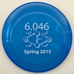

# [MIT OCW](https://ocw.mit.edu/index.htm)
it made sense to take them in this order
| Course ID| Youtube Playlist|
|---|---|
 | [6.0001-Introduction to Computer Science and Programming in Python](https://www.youtube.com/playlist?list=PLUl4u3cNGP63WbdFxL8giv4yhgdMGaZNA)
 | [6.00SC-Introduction to Computer Science and Programming](https://youtube.com/playlist?list=PLB2BE3D6CA77BB8F7)
 | [6-0002-Introduction to Computational Thinking and Data Science](https://www.youtube.com/playlist?list=PLUl4u3cNGP619EG1wp0kT-7rDE_Az5TNd)
 | [6-042j-Mathematics for Computer Science](https://youtube.com/playlist?list=PLB7540DEDD482705B)
 | [6-006-Introduction to Algorithms](https://www.youtube.com/playlist?list=PLUl4u3cNGP61Oq3tWYp6V_F-5jb5L2iHb)
 | [6-046j-Design and Analysis of Algorithms](https://www.youtube.com/playlist?list=PLUl4u3cNGP6317WaSNfmCvGym2ucw3oGp)