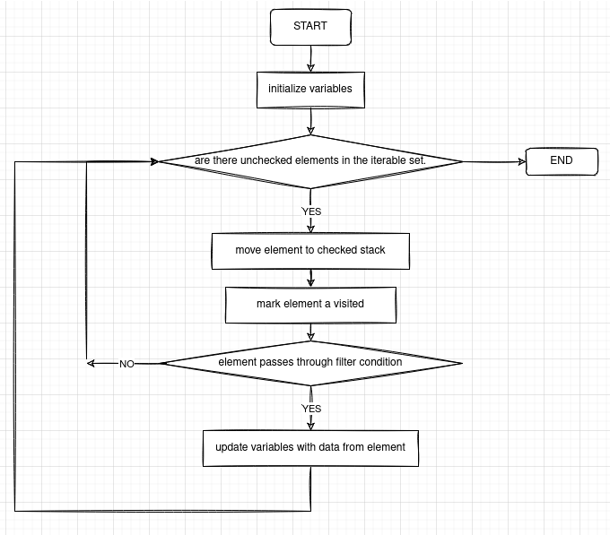

## Introduction to Datasets

-- > make a subset of data from the available set
### eg used in course

+ simplified reportcards
+ simplified shopping reciepts
+ words - letters and pos.

## Concepts of Variables, Iterators and Filtering

+ iterator goes across the data set ( or a filtered subset of it. (like case in statistics).
+ variables value is altered according to the value provided by the iterator.
+ one iteration can alter multiple variables.
+ important part is iteration pattern, ale initialization and variable initializzation
+ filtering means selecting a susbset of the data based on the value of one of the case-variabled (attribute of that data entry).
+ we can do multiple filters together, and nest the filtering within the iteration also.

## Iterations using Combination of Filter conditions

## Introduction to Flowcharts

###Symbols
+ Processs : Process/Activity - Operation that CHanges Vallue
+ Arrow : Connects things and shows order
+ Diamond : Decision / Conditional
+ Rounded Rectangle : Terminal - Indicates start or end of algorithm.

###  Generic Flowchart for Iteration



which is simply a pictorial representation of

```
 ================================
|st=>start: START                |
|e=>end: END                     |
|op1=>operation:Initialize       |
|               Variables        |
|op2=>operation:mark element as  |
|                       visited  |
|op3=>operation:move element to  |
|                   checked stack|
|op4=>operation:update variables |
|          with data from element|
|cond1=>condition: are there     |
|             unchecked elements |
|            in the iterable set.|
|cond2=>condition: element passes|
|        through filter condition|
|________________________________|
|                                |
|st->op1->cond1                  |
|cond1(no)->e(right)             |
|cond1(yes)->op2->op3->cond2     |
|cond2(yes)->op4->op1            |
|cond2(no)->op1                  |
 ================================
```

## Flowchart for Sum in Filtering