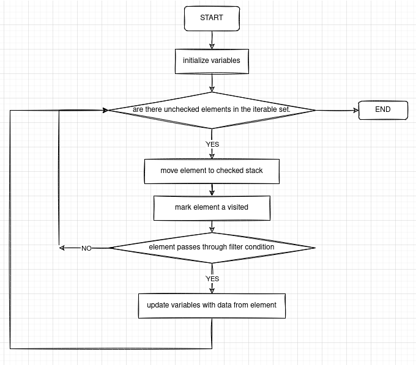

# playlist 
[yt](https://www.youtube.com/playlist?list=PLZ2ps__7DhBYSzaAFqpyQKqmoni-EefS7)

---
# data parsing and cleanup
main goal:
	make a subset of data from the available set
## running examples
+ simplified reportcards
+ simplified shopping reciepts
+ words - letters and pos.
+ station-trains - mutually indexing lists of stations and trains.
---
# Variables, Iterators and Filtering
+ iterator goes across the data set ( or a filtered subset of it. (like case in statistics).
+ variables value is altered according to the value provided by the iterator.
+ one iteration can alter multiple variables.
+ important part is iteration pattern, ale initialization and variable initializzation
+ filtering means selecting a susbset of the data based on the value of one of the case-variabled (attribute of that data entry).
+ we can do multiple filters together, and nest the filtering within the iteration also.
## Steps
1.Perform initialization Functions
2.Check for condition1. If Yes go to 3 else go to 8.
3.Perform Operation 2 /3 /... etc.
4.Perform filtering check. If succesful goto 6.
5.go to 2.
6.Remove item from Set,Perform tertiary operations 4/5.. etc
7.go to 2.
8.Extract All Variables.Iteration Over.

# flowcharts
> pictorial representation of computational process
## Node Types
	+ Decisions
	+ Operations
	+ Terminal
## Symbols
+ Processs : Process/Activity - Operation that CHanges Vallue
+ Arrow : Connects things and shows order and direction of operation flow
+ Diamond : Decision / Conditional
+ Rounded Rectangle : Terminal - Indicates start or end of algorithm.
## Generic Flowchart for Iteration

which is simply a pictorial representation of

```
================================
st   =>   start    : START
e    =>   end      : END
op1  =>   operation: Initialize Variables
op2  =>   operation: mark element a visited
op3  =>   operation: move element to checked stack
op4  =>   operation: update variables with data from element
cond1=> condition: are there unchecked elements in the iterable set.
cond2=> condition: element passes through filter condition
------------------------------------
st->op1->cond1
cond1(no)->e(right)
cond1(yes)->op2->op3->cond2
cond2(yes)->op4->op1
cond2(no)->cond1
================================

---
# conditional Termination in Iteration

```js
while (iterator){
	//----code---//
	if (condition):
		break;
	//---code---//
}
```
---
# Pseudo Codes
>For Large modules,it is more succint and simple to understand textual descriptions of the flowchart.
##PseudoCode
## Pseudocode for iteration with filtering
```js
varsᵢ =0;//or some other initializing val.
while (set.length>0){
	val1=item.prop1;//etc..
	if (filteringcondition){
		total+=c; etc..
	}
	set.remove current element.
}
```
---
# procedures and paramaters
+ compartmentelization of algorithm
+ repetative steps on different variables can be performed by a **procedure** that is defined to take in a **parameter**, on which it operates.
## steps
+ Invoke the Procedure with a parameter for the arguments it uses
+ delegation to module/procedure create need for communication b/w procedure's scope to instance's scope --> **return** value facilitates this communication. The result is passed back to where it was called.
+ Parameters fix the context
+ procedures modularize algorithms
## Side Effects of Procedure
+ parameters passed by **refference** are *changed*
+ data integrity is also part of the boundary interface. values that should not be changed should be passed by value.

# binning to reduce number of comparisons in nested iterations
+ Factor of reduction = (1-N)/(1 -N/K)
	+ K := number of bins (bins are equi-sized).
+ avoid the complexity of nested iterations
+ number of bins is a trade of between memory/space and time; more bins require more space for processing.

---
# Collections and Lists
* set pointing to different positions in another ordered set --> indexing list
	* basically an array of pointers.
	* demarcate where to find data in a collection that has been flagged.
	

# Insertion sort and ordered list
* ordered list makes comparison based and search based operations efficient.
* insertion sort is based on creating a new sorted array from the given array buy building up, inserting each encountered element into the new array in correct position by comparisons.
* invariant = sorted condition of build-up-list.
# dictionaries
# graph data structure
> vertexes connected by an edge when they are related.
## adjacency matrix
+ for random access use nested dictionaries indexed by integer == using 2d - arrays
+ graph connections represented in matrix with true / weight at i,j if ∃ edge i,j.
+ edge weight = distance/ fare etc.
+ distance  --> matrix multiplication
# cliques
> all nodes connected to each other and not connected to other nodes in the graph.
# degree
> number of incident edges onto a vertex (like popularity of student in freindship graph)

# similarity matrix
* calculate an aggregate measure based on which to judge similarity b/w data associated with vertices
* define a **distance function** between two nodes wrt this aggregate(s) or sum function of it.
* build a **similarity matrix** based on these distances.
	* each entry is the inverse of the distance between ```v[i]``` & ```v[j]```
	* the heighest entry in the matrix would be the most similar nodes wrt chosen measure.
# k-hop paths
# edge labeled graph
+ edge represents say, a train from the st dataset
# BFS
+ delay propogation
+ stringing nodes
# Depth First Search (DFS) and recursive procedure call
* reachability of stations example.
+ backtracing for parent resolution
+ finding cycles - mentoring example.
+ connecting both train and stations graph via mutual recursive calls.
# encapsulation, abstraction, class and object
# Decomposition of the study group problem to incorporate encapsulation and abstraction
# Producer - Consumer problem
# message passing using Remote Procedure Call (RPC)
+ request and response
# concurrent exwcution using polling and preemption
# message broadcasting
# Concept of Fair Teams
> they make study pairs with contrasting mark ratios in two subjects
+ two iterations thru the data
# Three Prizes Problem
+ Basic Criterion is Total Marks
+ Student must also be in top 3 marks in @ least 1 subject.
+ All three prizes must not be given to students of same Gender.
1. Procedure Top3Marks(Subject): returns thirdmax, which is the cutoff.
2. make 3 lists of subject wise eleigible students
3. find the intersection of the lists if it exists.
* from data of top 3 marks in each subject
* find if ∃ a student who has scored with top 3 in all subjects.
-


<!---------EOF----------------->
