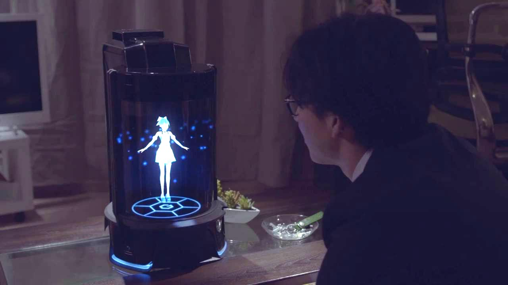
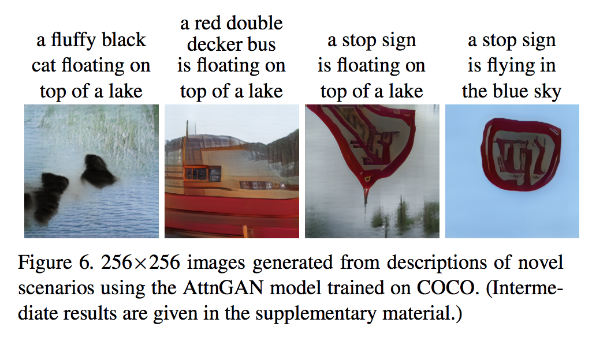

# Speech References




---

### Assignment

A Speech Game • Conversation System • Poetic Interlocutor

Create a (whimsical/provocative/sublime/playful) interactive game or system that uses speech input and/or speech output. Graphics are optional. 


---

### Things to See (or hear, really)

* [ELIZA](https://www.youtube.com/watch?v=CJWOOTMt4ko), an early natural language processing computer program created from 1964-1966 at the MIT Artificial Intelligence Laboratory by Joseph Weizenbaum. [(*At Wikipedia*)](https://en.wikipedia.org/wiki/ELIZA)
* [HAL](https://www.youtube.com/watch?v=ARJ8cAGm6JE&t=0m48s), from 2001 (Kubrick, 1968)
* [Her](https://www.youtube.com/watch?v=n1AjtIAje3o&t=1m30s)
* [Zork Text Adventure (1978)](http://textadventures.co.uk/games/play/5zyoqrsugeopel3ffhz_vq), one of the earliest interactive fiction computer games, written between 1977 and 1979, by members of the MIT Dynamic Modelling Group.
* [Two chatbots speaking with each other](https://www.youtube.com/watch?v=WnzlbyTZsQY) (2011)
* [Alexa, Siri, Echo](https://www.youtube.com/watch?v=vmINGWsyWX0), a performance with 'intelligent' readymades
* [*Giver of Names*, David Rokeby (1991-1997)](http://www.davidrokeby.com/gon.html)
* [*Listening Post*, Ben Rubin & Mark Hansen, 2001](https://vimeo.com/3885443)
* [Liam Walsh: Voice-driven children's books](https://www.youtube.com/watch?&v=rWHgzRH5ui8&t=1m12s)

#### Speech Synthesis

* [Wavenet](https://deepmind.com/blog/wavenet-generative-model-raw-audio/) (See gibberish examples)
* [Tacotron/Wavenet speech synthesis](https://google.github.io/tacotron/publications/tacotron2/)
* [Lyrebird](https://lyrebird.ai/demo/)
* [Kyle McDonald at Eyeo 2016](https://vimeo.com/178236531) 41:40.

#### Back and Forth between Images and Text

* [Put that There (Chris Schmandt, 1979)](https://www.youtube.com/watch?v=RyBEUyEtxQo)
* [Wordseye](https://www.wordseye.com/)
* [Images to Text Google Quickdraw](https://quickdraw.withgoogle.com/)
* [Images to Text: Neural Storytelling: Telling Stories about Images (Samim Winiger)](https://medium.com/@samim/generating-stories-about-images-d163ba41e4ed)
* [Text to Images: attnGAN](https://arxiv.org/pdf/1711.10485.pdf)



#### Games

Car Games, Rhyming Games; Saying the right thing, or saying it the right way

* Zoom Schwartz Profigliano
* I know you are, but what am I
* I'm rubber and you're glue
* Uh_huh (Reassurance) 
* Speech imitation games
* Pictionary
* Picnic game (Packing my Bags for Paris)
* In this fiction, a spoken interaction [leads you to the next step](https://www.youtube.com/watch?v=ReFhu8KYbmU)
* In this fiction, Only one kind of speech works: [Wingardium Leviosa](https://www.youtube.com/watch?v=nAQBzjE-kvI)

Creating a system that speaks algorithmically
* Pig Latin, Ubbi Dubbi
* Oracular speech: In this Blind Seer in Oh Brother Where Art Thou
https://www.youtube.com/watch?v=pukq_XJmM-k
Log Lady (Twin Peaks)
https://www.youtube.com/watch?v=Xt4ua_ZNoD0
https://www.youtube.com/watch?v=BloTVTziM6c&t=1m27s


#### Bots

[Taxonomy of Bots (2014)](http://www.gamesbyangelina.org/talks/codecamp.pdf)

* [Death Death Death by Rob Seward](https://vimeo.com/11464150)
* [pentametron](https://twitter.com/pentametron) – a strong example of recontextualization via curation
* [Art Assignment Bot](https://twitter.com/artassignbot)
* [@yourevalued](https://twitter.com/yourevalued)
* [@distractedgenie](https://twitter.com/distractedgenie)
* [@TwoHeadlines](https://twitter.com/TwoHeadlines)


**Google Voice Experiments**

* [Mystery Animal](https://experiments.withgoogle.com/voice/mystery-animal)
* [Paper Signals](https://experiments.withgoogle.com/voice/paper-signals)


---

### Tools: 

For this assignment, we will be using **p5.speech** and potentially **RiTa.js**. 

#### [**p5.speech**](http://ability.nyu.edu/p5.js-speech/)

```
> cd /Users/golan/Desktop/speech/p5.js/p5.js-speech 
> open http://localhost:8000/
> python -m SimpleHTTPServer
```

#### [**RiTa**](https://rednoise.org/rita/index.php)

RiTa is able to [break a word into syllables](https://rednoise.org/rita/reference/RiTa/RiTa.getSyllables/index.php); is able to know what a word [rhymes with](https://rednoise.org/rita/reference/RiTa/RiTa.isRhyme/index.php); is able to [tag parts of speech](https://rednoise.org/rita/reference/RiTa/RiTa.getPosTags/index.php), and much more. It works seamlessly with p5.js.

**Question**: if you go into an art supply store, do you just go right to the thing you want, buy it, and leave? Of course not. You browse. The [reference](https://rednoise.org/rita/reference/index.php) is your art supply store. Browse it. 

* [RandomRhymes](https://rednoise.org/rita/examples/p5js/RandomRhymes/)
* [Haiku Grammar](https://rednoise.org/rita/examples/p5js/HaikuGrammar/)
* [Analysis](https://rednoise.org/rita/examples/p5js/Analysis/)
* [Markov](https://rednoise.org/rita/examples/p5js/Kafgenstein/)

#### Some other Simple but Powerful Tools

* [Compromise](https://github.com/spencermountain/compromise)
* [Bottery](https://github.com/google/bottery)

---

### New Links (2019)

Unincorporated links (TODO)

* [Juerg Lehni, Apple Talk](http://juerglehni.com/works/apple-talk)
* [Shannon Mattern, *History of Vocal Interfaces*](http://www.wordsinspace.net/interfaces/2019/portfolio/march-26-history-of-vocal-interfaces/)
* [Shannon Mattern, *Contemporary Vocal Interfaces*](http://www.wordsinspace.net/interfaces/2019/portfolio/april-2-contemporary-vocal-interfaces/)
* [Nicole He, *Fifteen Unconventional Uses of Voice Technology*](https://medium.com/@nicolehe/fifteen-unconventional-uses-of-voice-technology-fa1b749c14bf)
* [Projects by Nicole He](http://nicole.pizza/)
* [Nicole He, *Talking to Computers* (lecture)](https://www.youtube.com/watch?v=-TduI4IZ6SM)
* [Perry Cook, VOCE: Voice + Technology](http://www.vocebella.org/)

