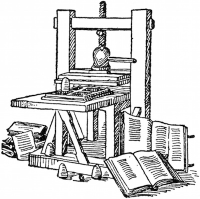

# Introduction

<canvas id="custom" class="canvas" data-fragment-url="cmyk-halftone.frag" data-textures="vangogh.jpg" width="700px" height="320px"></canvas>

As imagens acima foram feitas de maneiras diferentes. A primeira foi feita pela mão do Van Gogh, aplicando-se camada a camada de tinta. Levou horas. A segunda foi produzida em segundos pela combinação de quatro matrizes de pixel: uma para ciano, uma para magenta, um para amarelo e outro pra preto. A diferença chave é que a segunda imagem é produzida de forma não-serial (ou seja, não foi passo a passo, mas todos ao mesmo tempo).

Este livro é sobre a técnica computacional revolucionária, *fragment shaders*, que está levando imagens geradas digitalmente a um nível mais alto. Você pode pensar nisso como sendo o equivalente à impressa de Gutenberg para gráficos.

Fragment shaders te dão controle total sobre os pixels rendereizados na tela, em velocidade super. É por isso que eles são usados para todas as finalidades, desde filtros de vídeo em celulares até videogames 3D incríveis.

Nos capítulos seguintes, você vai descobrir o quão incrivelmente rápida e poderosa é essa técnica, e como aplicá-la para seu trabalho pessoal e profissional.

## Para quem é este livro?

Este livro é escrito para programadores criativos, desenvolvedores de jogos e engenheiros que têm experiência em codificação, um conhecimento básico de álgebra linear e trigonometria, e quem quiser levar seu trabalho a um novo nível excitante de qualidade gráfica (se você quer aprender como programar, eu recomendo fortemente que comece com o [Processing](https://processing.org/) e volte mais tarde quando estiver comfortável com isso.).

Este livro vai te ensinar como usar e integrar shaders em seus projetos, melhorando a qualidade gráfica e performance. Devido ao fato de shaders GLSL (OpenGL Shading Language) compilarem e rodarem em grande variedade de plataformas, você vai poder aplicar o que aprendeu aqui para qualquer ambiente que usar OpenGL, OpenGL ES ou WebGL. Em outras palavras, você vai poder aplicar e usar seu conhecimento com sketches do [Processing](https://processing.org/), aplicações [openFrameworks](http://openframeworks.cc/) , instalações interativas [Cinder](http://libcinder.org/) , websites [Three.js](http://threejs.org/) ou jogos  iOS/Android.

## O que este livro cobre?

Este livro vai focar no uso de shaders de pixel em GLSL. Primeiro vamos definir o que são os shaders; então vamos aprender como fazer formas proceduralmente, padrões, texturas e animações com eles. Você vai aprender as fundações da linguagem de shaders e como aplicar em cenários mais úteis, como: processamento de imagens (operações com imagens, convoluções de matrizes, blurs, filtros de cores, tabelas de lookup, e outros efeitos) e simulações (jogo da vida de Conway, reação e difusão de Gray-Scott, ondas em água, efeitos de cores de água, células de Voroni, etc). Em direção ao fim do livro, vamos ver um conjunto de técnicas avançadas baseadas em Ray Marching.

*Existem exemplos interativos para você brincar em cada capítulo.* Quando você muda o código, vai ver as mudanças imediatamente. os conceitos podem ser abstratos e confusos, então os exemplos interativos são essenciais para ajudá-lo a aprender o material. Quanto mais rápido você colocar os conceitos em movimento, mais fácil será o processo de aprendizagem.

O que esse livro não cobre:

* Este *não é* um livro de openGL ou webGL. OpenGL/webGL é um assunto maior que GLSL ou fragment shaders. Para aprender mais sobre openGL/webGL eu recomendo dar uma olhada em:  [OpenGL Introduction](https://open.gl/introduction), [the 8th edition of the OpenGL Programming Guide](http://www.amazon.com/OpenGL-Programming-Guide-Official-Learning/dp/0321773039/ref=sr_1_1?s=books&ie=UTF8&qid=1424007417&sr=1-1&keywords=open+gl+programming+guide) (também conhecido como o livro vermelho) ou [WebGL: Up and Running](http://www.amazon.com/WebGL-Up-Running-Tony-Parisi/dp/144932357X/ref=sr_1_4?s=books&ie=UTF8&qid=1425147254&sr=1-4&keywords=webgl)

* Este *não é* um livro de matemática. Embora venhamos a cobrir um bom número de algoritmos e técnicas que se baseiam no entendimento de álgebra e trigonometria, não vamos explicá-los em detalhes. Para questões relacionadas com matemática eu recomendo que você tenha um desses livros por perto: [3rd Edition of Mathematics for 3D Game Programming and computer Graphics](http://www.amazon.com/Mathematics-Programming-Computer-Graphics-Third/dp/1435458869/ref=sr_1_1?ie=UTF8&qid=1424007839&sr=8-1&keywords=mathematics+for+games) ou [2nd Edition of Essential Mathematics for Games and Interactive Applications](http://www.amazon.com/Essential-Mathematics-Games-Interactive-Applications/dp/0123742978/ref=sr_1_1?ie=UTF8&qid=1424007889&sr=8-1&keywords=essentials+mathematics+for+developers).

## O que você precisa para começar?

Não muito! Se você tem um browser modernos que possa rodar WebGL (como Chrome, Firefox ou Safari) e uma conexão à internet, clique no botão para o próximo capítulo no fim desta página para começar.

Alternativamente, baseado no que você tem, ou no que você precisa deste livro você pode:

- [Fazer uma versão offline deste livro](https://thebookofshaders.com/appendix/00/)

- [Rodar os exemplos em um Raspberry Pi sem um browser](https://thebookofshaders.com/appendix/01/)

- [Fazer um PDF do livro para imprimir](https://thebookofshaders.com/appendix/02/)

- Checar o [repositório GitHub](https://github.com/patriciogonzalezvivo/thebookofshaders) deste livro para ajudar a resolver questões e compartilhar código.
