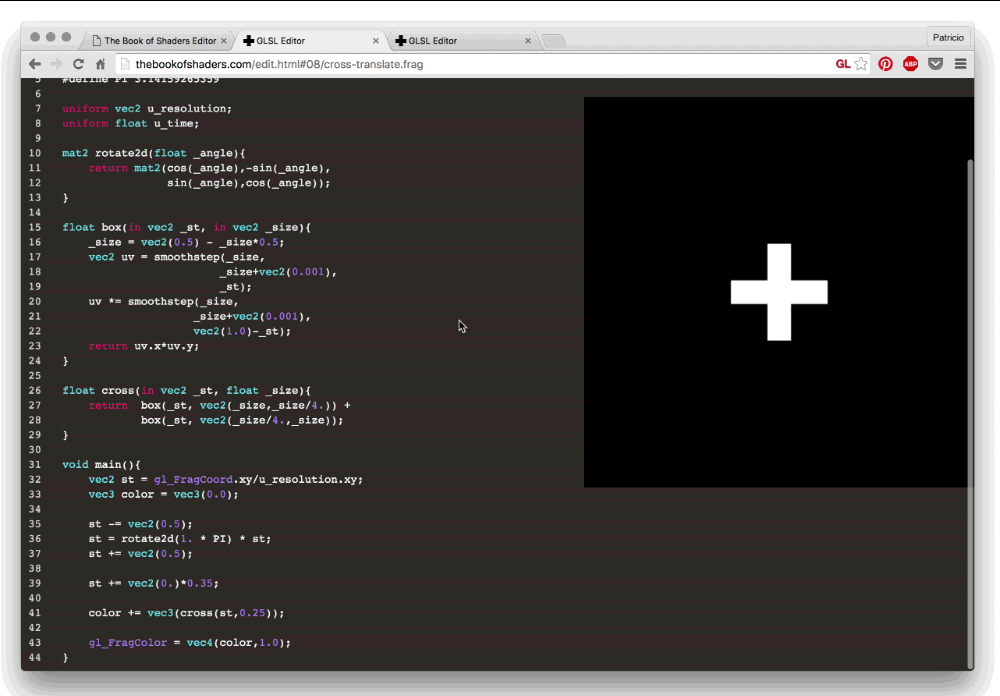
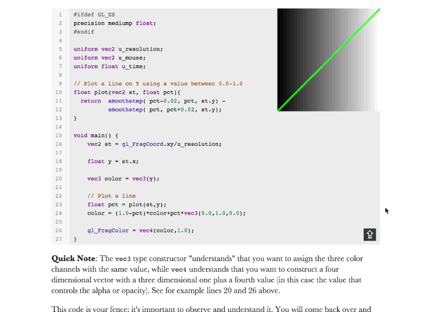

## Запуск шейдера

В процессе создания этой книги и просто из любви к искусству я создал набор инструментов для создания, отображения, опубликования и сопровождения шейдеров. Эти инструменты работают одинаково на Linux, MacOS, [Raspberry Pi](https://www.raspberrypi.org/) и в браузерах без переписывания кода.

**Отображение**: все интерактивные примеры в книге показываются с помощью [glslCanvas](https://github.com/patriciogonzalezvivo/glslCanvas), который делает процесс запуска отдельных шейдеров невероятно простым.

```html
<canvas class="glslCanvas" data-fragment-url=“yourShader.frag" data-textures=“yourInputImage.png” width="500" height="500"></canvas>
```

Как видите, для этого нужен всего лишь элемент `canvas` с классом `class="glslCanvas"` и URL шейдера в свойстве `data-fragment-url`. Подробнее о нём можно узнать [здесь](https://github.com/patriciogonzalezvivo/glslCanvas).

Если вы разделяете мой подход к разработке, вам возможно захочется запускать шейдеры напрямую из консоли, в чём вам поможет [glslViewer](https://github.com/patriciogonzalezvivo/glslViewer). Это приложение позволяет встраивать шейдеры в `bash`-скрипты или конвейер unix, и может использоваться по аналогии с [ImageMagick](http://www.imagemagick.org/script/index.php). Так же, [glslViewer](https://github.com/patriciogonzalezvivo/glslViewer) - отличный способ скомпилировать шейдеры на [Raspberry Pi](https://www.raspberrypi.org/), и поэтому он используется на [openFrame.io](http://openframe.io/) для демонстрации шейдеров. Подробнее с этим приложением можно познакомиться [здесь](https://github.com/patriciogonzalezvivo/glslViewer).

```bash
glslViewer yourShader.frag yourInputImage.png —w 500 -h 500 -s 1 -o yourOutputImage.png
```

**Создание**: чтобы сделать опыт создания шейдеров более ярким, я сделал онлайн-редактор [glslEditor](https://github.com/patriciogonzalezvivo/glslEditor). Этот редактор используется для демонстрации интерактивных примеров в книге и предоставляет набор виджетов, делающих абстрактный код на GLSL более осязаемым. Его так же можно запустить в отдельном веб-приложении по адресу [editor.thebookofshaders.com](http://editor.thebookofshaders.com/). Подробнее о редакторе [здесь](https://github.com/patriciogonzalezvivo/glslEditor).



Если вы предпочитаете работать оффлайн в редакторе [SublimeText](https://www.sublimetext.com/), вы можете установить [пакет для glslViewer](https://packagecontrol.io/packages/glslViewer). Подробнее [здесь](https://github.com/patriciogonzalezvivo/sublime-glslViewer).


**Публикация**: онлайн-редактор ([editor.thebookofshaders.com/](http://editor.thebookofshaders.com/)) может опубликовать ваш шейдер! Как встраиваемая, так и отдельная версия содержат кнопку «экспорт», которая выдаёт уникальные URL каждому шейдеру. Так же есть возможность выгружать шейдеры сразу на [openFrame.io](http://openframe.io/).



**Сопровождение**: Публикация кода - это только первый шаг на пути вашего шейдера в качестве художественного произведения. Помимо возможности экспорта на [openFrame.io](http://openframe.io/), я создал инструмент [glslGallery](https://github.com/patriciogonzalezvivo/glslGallery) для размещения шейдеров в галерее, которую можно встроить на любой сайт. Подробнее [здесь](https://github.com/patriciogonzalezvivo/glslGallery).


## Запуск шейдера в вашем любимом фреймворке

Если у вас уже есть опыт программирования на таких фреймворках, как [Processing](https://processing.org/), [Three.js](http://threejs.org/), [OpenFrameworks](http://openframeworks.cc/) или [SFML](https://www.sfml-dev.org/), вы можете попробовать шейдеры прямо в них. Ниже показаны способы установки используемых в книге uniform-переменных на некоторых популярных фреймворках. В [репозитории](https://github.com/patriciogonzalezvivo/thebookofshaders/tree/master/04) этой главы на Гитхабе вы найдёте полный исходный код для этих трёх фреймворков.

### **Three.js**

Рикардо Кабелло (aka [MrDoob](https://twitter.com/mrdoob) ) и группа [единомышленников](https://github.com/mrdoob/three.js/graphs/contributors) разработали один из лучших WebGL-фреймворков под названием [Three.js](http://threejs.org/). Там вы найдёте множество примеров, учебных курсов и книг с помощью которых можно создавать крутую 3D-графику на JavaScript.

Ниже вы видите минимальный пример HTML и JS-кода, позволяющего начать использовать шейдеры на three.js. Обратите внимание на скрипт с `id="fragmentShader"`. Именно благодаря ему вы можете копировать шейдеры из книги.

```html
<body>
    <div id="container"></div>
    <script src="js/three.min.js"></script>
    <script id="vertexShader" type="x-shader/x-vertex">
        void main() {
            gl_Position = vec4( position, 1.0 );
        }
    </script>
    <script id="fragmentShader" type="x-shader/x-fragment">
        uniform vec2 u_resolution;
        uniform float u_time;

        void main() {
            vec2 st = gl_FragCoord.xy/u_resolution.xy;
            gl_FragColor=vec4(st.x,st.y,0.0,1.0);
        }
    </script>
    <script>
        var container;
        var camera, scene, renderer, clock;
        var uniforms;

        init();
        animate();

        function init() {
            container = document.getElementById( 'container' );

            camera = new THREE.Camera();
            camera.position.z = 1;

            scene = new THREE.Scene();
            clock = new THREE.Clock();

            var geometry = new THREE.PlaneBufferGeometry( 2, 2 );

            uniforms = {
                u_time: { type: "f", value: 1.0 },
                u_resolution: { type: "v2", value: new THREE.Vector2() },
                u_mouse: { type: "v2", value: new THREE.Vector2() }
            };

            var material = new THREE.ShaderMaterial( {
                uniforms: uniforms,
                vertexShader: document.getElementById( 'vertexShader' ).textContent,
                fragmentShader: document.getElementById( 'fragmentShader' ).textContent
            } );

            var mesh = new THREE.Mesh( geometry, material );
            scene.add( mesh );

            renderer = new THREE.WebGLRenderer();
            renderer.setPixelRatio( window.devicePixelRatio );

            container.appendChild( renderer.domElement );

            onWindowResize();
            window.addEventListener( 'resize', onWindowResize, false );

            document.onmousemove = function(e){
              uniforms.u_mouse.value.x = e.pageX
              uniforms.u_mouse.value.y = e.pageY
            }
        }

        function onWindowResize( event ) {
            renderer.setSize( window.innerWidth, window.innerHeight );
            uniforms.u_resolution.value.x = renderer.domElement.width;
            uniforms.u_resolution.value.y = renderer.domElement.height;
        }

        function animate() {
            requestAnimationFrame( animate );
            render();
        }

        function render() {
            uniforms.u_time.value += clock.getDelta();
            renderer.render( scene, camera );
        }
    </script>
</body>
```

### **Processing**

[Processing](https://processing.org/) - необычайно простая и мощная среда, созданная [Беном Фраем](http://benfry.com/) и [Кэси Рис](http://reas.com/) в 2001 году. Она хорошо подходит для того, чтобы сделать ваши первые шаги в программировании (по крайней мере, так было у меня). [Андре Колубри](https://codeanticode.wordpress.com/) добавил в Processing поддержку OpenGL и видео, из-за чего играть с шейдерами в ней стало проще простого. Processing ищет файл с именем `shader.frag` в папке `data` вашего скетча. Таким образом, вы можете просто скопировать пример отсюда и переименовать файл.

```cpp
PShader shader;

void setup() {
  size(640, 360, P2D);
  noStroke();

  shader = loadShader("shader.frag");
  shader.set("u_resolution", float(width), float(height));
}

void draw() {
  shader.set("u_mouse", float(mouseX), float(mouseY));
  shader.set("u_time", millis() / 1000.0);
  shader(shader);
  rect(0,0,width,height);
}
```

Чтобы шейдеры запустились на версиях ниже 2.1, добавьте строку `#define PROCESSING_COLOR_SHADER` в начало шейдера. В итоге, код шейдера будет выглядеть примерно так:

```glsl
#ifdef GL_ES
precision mediump float;
#endif

#define PROCESSING_COLOR_SHADER

uniform vec2 u_resolution;
uniform vec3 u_mouse;
uniform float u_time;

void main() {
    vec2 st = gl_FragCoord.st/u_resolution;
    gl_FragColor = vec4(st.x,st.y,0.0,1.0);
}
```

Более подробную информацию о шейдерах в Processing ищите в [этом руководстве](https://processing.org/tutorials/pshader/).

### **openFrameworks**

У каждого человека есть место, где ему комфортно, и для меня таковым остаётся [сообщество openFrameworks](http://openframeworks.cc/). Этот C++-фреймворк является обёрткой для OpenGL и других библиотек на C++. Он во многом похож на Processing с поправкой на особенности использования компиляторов языка C++. Как и Processing, openFramework ищет шейдеры в папке `data`, поэтому не забудьте скопировать в него и файлы с расширением `.frag` и переименовывать их перед использованием.

```cpp
void ofApp::draw(){
    ofShader shader;
    shader.load("","shader.frag");

    shader.begin();
    shader.setUniform1f("u_time", ofGetElapsedTimef());
    shader.setUniform2f("u_resolution", ofGetWidth(), ofGetHeight());
    ofRect(0,0,ofGetWidth(), ofGetHeight());
    shader.end();
}
```

За более подробной информацией о шейдерах в openFrameworks обратитесь к [этому руководству](http://openframeworks.cc/ofBook/chapters/shaders.html) от [Joshua Noble](http://thefactoryfactory.com/).
