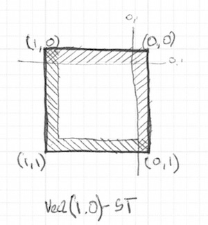
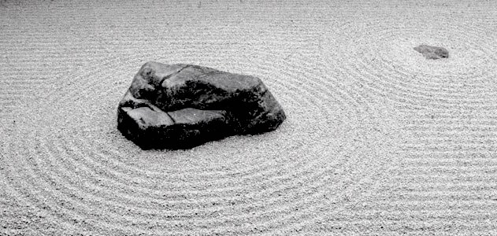

## Bentuk

Akhirnya! Kami telah membangun keterampilan untuk saat ini! Anda telah mempelajari sebagian besar fondasi, jenis, dan fungsi GLSL. Anda telah mempraktikkan persamaan pembentuk Anda berulang kali. Sekaranglah waktunya untuk menggabungkan semuanya. Anda siap untuk tantangan ini! Dalam bab ini Anda akan belajar cara menggambar bentuk sederhana dengan cara prosedural paralel.

### Persegi panjang

Bayangkan kita memiliki kertas grid seperti yang kita gunakan di kelas matematika dan pekerjaan rumah kita adalah menggambar persegi. Ukuran kertas adalah 10x10 dan persegi seharusnya 8x8. Apa yang akan kamu lakukan?


Anda akan mengecat semuanya kecuali baris pertama dan terakhir dan kolom pertama dan terakhir, bukan?

Bagaimana ini berhubungan dengan shader? Setiap kotak kecil dari kertas kisi kami adalah thread (piksel). Setiap kotak kecil mengetahui posisinya, seperti koordinat papan catur. Di bab sebelumnya, kita memetakan *x* dan *y* ke saluran warna *merah* dan *hijau*, dan kita belajar cara menggunakan wilayah dua dimensi yang sempit antara 0,0 dan 1,0. Bagaimana kita bisa menggunakan ini untuk menggambar kotak di tengah di tengah papan reklame kita?

Mari kita mulai dengan membuat sketsa pseudocode yang menggunakan pernyataan `if` di atas bidang spasial. Prinsip untuk melakukan ini sangat mirip dengan bagaimana kita memikirkan skenario kertas grid.

```glsl
uniform vec2 u_resolution;

void main(){
    vec2 st = gl_FragCoord.xy/u_resolution.xy;
    vec3 color = vec3(0.0);

    // Each result will return 1.0 (white) or 0.0 (black).
    float left = step(0.1,st.x);   // Similar to ( X greater than 0.1 )
    float bottom = step(0.1,st.y); // Similar to ( Y greater than 0.1 )

    // The multiplication of left*bottom will be similar to the logical AND.
    color = vec3( left * bottom );

    gl_FragColor = vec4(color,1.0);
}
```

Fungsi [`step()`](../glossary/?search=step) akan mengubah setiap piksel di bawah 0,1 menjadi hitam (`vec3(0,0)`) dan sisanya menjadi putih (`vec3(1.0)`). Perkalian antara `left` dan` bottom` berfungsi sebagai operasi logika `AND`, di mana keduanya harus bernilai 1,0 untuk mengembalikan 1,0. Ini menggambar dua garis hitam, satu di bagian bawah dan yang lainnya di sisi kiri kanvas.


Pada kode sebelumnya kami mengulangi struktur untuk setiap sumbu (kiri dan bawah). Kita dapat menyimpan beberapa baris kode dengan meneruskan dua nilai secara langsung ke [`step()`](../glossary/?search=step) alih-alih satu. Itu terlihat sperti ini:

```glsl
vec2 borders = step(vec2(0.1),st);
float pct = borders.x * borders.y;
```

Sejauh ini, kita hanya menggambar dua garis tepi (kiri bawah) dari persegi panjang kita. Mari lakukan dua lainnya (kanan atas). Lihat kode berikut:

<div class="codeAndCanvas" data="rect-making.frag"></div>

Hapus tanda komentar *baris 21-22* dan lihat bagaimana kita membalik koordinat `st` dan ulangi fungsi [`step()`](../glossary/?search=step) yang sama. Dengan begitu, `vec2(0.0,0.0)` akan berada di pojok kanan atas. Ini adalah persamaan digital dengan membalik halaman dan mengulangi prosedur sebelumnya.



Perhatikan bahwa dalam *baris 18 dan 22* ​​semua sisinya akan dikalikan. Ini sama dengan menulis:

```glsl
vec2 bl = step(vec2(0.1),st);       // bottom-left
vec2 tr = step(vec2(0.1),1.0-st);   // top-right
color = vec3(bl.x * bl.y * tr.x * tr.y);
```
Menarik kan? Teknik ini adalah tentang penggunaan [`step()`](../glossary/?search=step) dan perkalian untuk operasi logika dan membalik koordinat.

Sebelum melanjutkan, cobalah latihan berikut:

* Ubah ukuran dan proporsi persegi panjang.

* Lakukan percobaan dengan kode yang sama tetapi menggunakan [`smoothstep ()`](../glossary/?search=smoothstep) daripada [`step()`](../glossary/?search=step). Perhatikan bahwa dengan mengubah nilai, Anda dapat beralih dari tepi yang buram ke tepi halus yang elegan.

* Lakukan implementasi lain yang menggunakan [`floor()`](../glossary/?search=floor).

* Pilih implementasi yang paling Anda sukai dan buat fungsinya yang dapat Anda gunakan kembali di masa mendatang. Jadikan fungsi Anda fleksibel dan efisien.

* Buat fungsi lain yang hanya menggambar garis bentuk persegi panjang.

* Menurut Anda, bagaimana Anda dapat memindahkan dan menempatkan persegi panjang yang berbeda di papan iklan yang sama? Jika Anda tahu caranya, tunjukkan keahlian Anda dengan membuat komposisi persegi panjang dan warna-warni yang menyerupai lukisan [Piet Mondrian](http://en.wikipedia.org/wiki/Piet_Mondrian).


### Lingkaran

Sangat mudah untuk menggambar kotak pada kertas kisi dan persegi panjang pada koordinat kartesius, tetapi lingkaran memerlukan pendekatan lain, terutama karena kita memerlukan algoritme "per piksel". Salah satu solusinya adalah dengan * memetakan ulang * koordinat spasial sehingga kita dapat menggunakan fungsi [`step()`](../glossary/?search=step) untuk menggambar lingkaran.

Bagaimana? Mari kita mulai dengan kembali ke kelas matematika dan kertas kisi, di mana kita membuka kompas ke jari-jari lingkaran, menekan salah satu titik kompas di tengah lingkaran dan kemudian menelusuri tepi lingkaran dengan putaran sederhana.


Menerjemahkan ini ke shader di mana setiap kotak pada kertas kisi adalah piksel menyiratkan * menanyakan * setiap piksel (atau thread) apakah itu di dalam area lingkaran. Kami melakukan ini dengan menghitung jarak dari piksel ke pusat lingkaran.


Ada beberapa cara untuk menghitung jarak tersebut. Yang termudah menggunakan fungsi [`distance()`](../glossary/?search=distance), yang secara internal menghitung [`length()`](../glossary/?search=length) dari perbedaan antara dua titik (dalam kasus kami koordinat piksel dan pusat kanvas). Fungsi `length()` tidak lain adalah jalan pintas dari [persamaan sisi miring](http://en.wikipedia.org/wiki/Hypotenuse) yang menggunakan akar kuadrat ([`sqrt()`](../glosarium/?search=sqrt)) secara internal.


Anda dapat menggunakan [`distance()`](../glossary/?search=distance), [`length()`](../glossary/?search=length) atau [`sqrt()`](../glossary/?search=sqrt) untuk menghitung jarak ke pusat billboard. Kode berikut berisi tiga fungsi ini dan fakta yang tidak mengejutkan bahwa masing-masing mengembalikan hasil yang persis sama.

* Baris komentar dan hapus komentar untuk mencoba berbagai cara untuk mendapatkan hasil yang sama.

<div class="codeAndCanvas" data="circle-making.frag"></div>

Pada contoh sebelumnya kami memetakan jarak ke tengah papan reklame dengan kecerahan warna piksel. Semakin dekat sebuah piksel ke tengah, nilai yang lebih rendah (lebih gelap) dimilikinya. Perhatikan bahwa nilainya tidak terlalu tinggi karena dari pusat (`vec2(0,5, 0,5)`) jarak maksimum hampir tidak melebihi 0,5. Renungkan peta ini dan pikirkan:

* Apa yang dapat Anda simpulkan darinya?

* Bagaimana kita bisa menggunakan ini untuk menggambar lingkaran?

* Ubah kode di atas untuk memuat seluruh gradien melingkar di dalam kanvas.

### Bidang jarak

Kita juga bisa menganggap contoh di atas sebagai peta ketinggian, di mana lebih gelap berarti lebih tinggi. Gradien menunjukkan kepada kita sesuatu yang mirip dengan pola yang dibuat oleh kerucut. Bayangkan diri Anda berada di atas kerucut itu. Jarak horizontal ke tepi kerucut adalah 0,5. Ini akan konstan ke segala arah. Dengan memilih tempat untuk “memotong” kerucut, Anda akan mendapatkan permukaan lingkaran yang lebih besar atau lebih kecil.


Pada dasarnya kami menggunakan interpretasi ulang ruang (berdasarkan jarak ke pusat) untuk membuat bentuk. Teknik ini dikenal sebagai "bidang jarak" dan digunakan dalam berbagai cara dari garis font hingga grafik 3D.

Coba latihan berikut:

* Gunakan [`step()`](../glossary/?search=step) untuk mengubah semua yang di atas 0,5 menjadi putih dan semua yang di bawah menjadi 0,0.

* Membalikkan warna latar belakang dan latar depan.

* Menggunakan [`smoothstep()`](../glossary/?search=smoothstep), bereksperimenlah dengan nilai yang berbeda untuk mendapatkan batas halus yang bagus di lingkaran Anda.

* Setelah Anda puas dengan implementasinya, buatlah fungsinya yang dapat Anda gunakan kembali di masa mendatang.

* Tambahkan warna pada lingkaran.

* Bisakah Anda menganimasikan lingkaran Anda untuk tumbuh dan menyusut, menirukan detak jantung? (Anda bisa mendapatkan inspirasi dari animasi di bab sebelumnya.)

* Bagaimana dengan memindahkan lingkaran ini? Bisakah Anda memindahkannya dan menempatkan lingkaran yang berbeda dalam satu papan iklan?

* Apa yang terjadi jika Anda menggabungkan bidang jarak bersama menggunakan fungsi dan operasi yang berbeda?

```glsl
pct = distance(st,vec2(0.4)) + distance(st,vec2(0.6));
pct = distance(st,vec2(0.4)) * distance(st,vec2(0.6));
pct = min(distance(st,vec2(0.4)),distance(st,vec2(0.6)));
pct = max(distance(st,vec2(0.4)),distance(st,vec2(0.6)));
pct = pow(distance(st,vec2(0.4)),distance(st,vec2(0.6)));
```

* Buat tiga komposisi menggunakan teknik ini. Jika dianimasikan, bahkan lebih baik!

#### Untuk kotak alat Anda

Dalam hal daya kompthreadi, fungsi [`sqrt()`](../glossary/?search=sqrt) - dan semua fungsi yang bergantung padanya - bisa jadi mahal. Berikut adalah cara lain untuk membuat bidang jarak melingkar dengan menggunakan perkalian [`dot()`](../glossary/?search=dot).

<div class="codeAndCanvas" data="circle.frag"></div>

### Properti yang berguna dari Bidang Jarak



Bidang jarak dapat digunakan untuk menggambar hampir semua hal. Jelas, semakin kompleks suatu bentuk, semakin rumit persamaannya, tetapi setelah Anda memiliki rumus untuk membuat bidang jarak dari bentuk tertentu, sangat mudah untuk menggabungkan dan / atau menerapkan efek padanya, seperti tepi halus dan beberapa garis tepi . Karenanya, kolom jarak menjadi populer dalam rendering font, seperti [Label GL Kotak Peta](https://blog.mapbox.com/drawing-text-with-signed-distance-fields-in-mapbox-gl-b0933af6f817), [Matt DesLauriers](https://twitter.com/mattdesl) [Font Desain Material](http://mattdesl.svbtle.com/material-design-on-the-gpu) dan [seperti yang di jelaskan di Bab 7 di buku Phone 3D Programming, O’Reilly](http://chimera.labs.oreilly.com/books/1234000001814/ch07.html#ch07_id36000921).

Perhatikan kode berikut.

<div class="codeAndCanvas" data="rect-df.frag"></div>

Kita mulai dengan memindahkan sistem koordinat ke tengah dan menyusutkannya menjadi dua untuk memetakan kembali nilai posisi antara -1 dan 1. Juga pada *baris 24* kita memvisualisasikan nilai bidang jarak menggunakan [`fract()`](../glossary/?search=fract) berfungsi memudahkan untuk melihat pola yang mereka buat. Pola bidang jarak berulang seperti cincin di taman Zen.

Mari kita lihat rumus bidang jarak pada *baris 19 *. Di sana kita menghitung jarak ke posisi pada `(.3, .3)` atau `vec3 (.3)` di keempat kuadran (itulah yang [`abs()`](../glossary/?search=abs) melakukannya di sana).

Jika Anda menghapus komentar *baris 20*, Anda akan melihat bahwa kami menggabungkan jarak ke empat titik ini menggunakan [`min()`](../glossary/?search=min) ke nol. Hasilnya menghasilkan pola baru yang menarik.

Sekarang coba hapus komentar *baris 21*; kita melakukan hal yang sama tetapi menggunakan fungsi [`max()`](../glossary/?search=max). Hasilnya adalah persegi panjang dengan sudut membulat. Perhatikan bagaimana cincin bidang jarak semakin halus semakin jauh dari pusat.

Selesaikan tanda komentar *baris 27 hingga 29* satu per satu untuk memahami perbedaan penggunaan pola bidang jarak.

### Bentuk kutub


Pada bab tentang warna kita memetakan koordinat kartesian ke koordinat kutub dengan menghitung *radius* dan *sudut* dari setiap piksel dengan rumus berikut:

```glsl
vec2 pos = vec2(0.5)-st;
float r = length(pos)*2.0;
float a = atan(pos.y,pos.x);
```

Kami menggunakan bagian dari rumus ini di awal bab untuk menggambar lingkaran. Kami menghitung jarak ke pusat menggunakan [`length()`](../glossary/?search=length). Sekarang kita tahu tentang bidang jarak, kita dapat mempelajari cara lain untuk menggambar bentuk menggunakan koordinat kutub.

Teknik ini sedikit membatasi tetapi sangat sederhana. Ini terdiri dari mengubah jari-jari lingkaran tergantung pada sudut untuk mencapai bentuk yang berbeda. Bagaimana cara kerja modulasi? Ya, menggunakan fungsi pembentukan!

Di bawah ini Anda akan menemukan fungsi yang sama dalam grafik kartesius dan dalam contoh shader koordinat kutub (antara * baris 21 dan 25 *). Hapus tanda komentar fungsi satu per satu, perhatikan hubungan antara satu sistem koordinat dan sistem koordinat lainnya.

<div class="simpleFunction" data="y = cos(x*3.);
//y = abs(cos(x*3.));
//y = abs(cos(x*2.5))*0.5+0.3;
//y = abs(cos(x*12.)*sin(x*3.))*.8+.1;
//y = smoothstep(-.5,1., cos(x*10.))*0.2+0.5;"></div>

<div class="codeAndCanvas" data="polar.frag"></div>

Cobalah untuk:

* Animasikan bentuk-bentuk ini.
* Gabungkan berbagai fungsi pembentukan untuk *memotong lubang* dalam bentuk untuk membuat bunga, kepingan salju, dan roda gigi.
* Gunakan fungsi `plot()` yang kami gunakan di *Shaping Functions Chapter* untuk menggambar kontur saja.

### Menggabungkan kekuatan

Sekarang kita telah mempelajari cara memodulasi jari-jari lingkaran sesuai dengan sudut menggunakan [`atan()`](../glossary/?search=atan) untuk menggambar berbagai bentuk, kita dapat mempelajari cara menggunakan `atan()` dengan bidang jarak dan menerapkan semua trik dan efek yang mungkin dilakukan dengan bidang jarak.

Triknya akan menggunakan jumlah tepi poligon untuk membuat bidang jarak menggunakan koordinat kutub. Lihat [kode berikut](http://thndl.com/square-shaped-shaders.html) dari [Andrew Baldwin](https://twitter.com/baldand).

<div class="codeAndCanvas" data="shapes.frag"></div>

* Menggunakan contoh ini, buat fungsi yang memasukkan posisi dan jumlah sudut dari bentuk yang diinginkan dan mengembalikan nilai bidang jarak.

* Campurkan bidang jarak bersama-sama menggunakan [`min()`](../glossary/?search=min) dan [`max()`](../glossary/?search=max).

* Pilih logo geometris untuk direplikasi menggunakan bidang jarak.

Selamat! Anda telah berhasil melewati bagian yang sulit! Beristirahatlah dan biarkan konsep ini menyelesaikan - menggambar bentuk sederhana dalam Pemrosesan itu mudah tetapi tidak di sini. Dalam bentuk gambar tanah shader dipelintir, dan dapat melelahkan untuk beradaptasi dengan paradigma baru pengkodean ini.

Di bagian akhir bab ini, Anda akan menemukan tautan ke [PixelSpirit Deck](https://patriciogonzalezvivo.github.io/PixelSpiritDeck/) setumpuk kartu ini akan membantu Anda mempelajari fungsi SDF baru, menyusunnya ke dalam desain dan menggunakannya di shader Anda. Dek memiliki kurva belajar progresif, jadi mengambil satu kartu sehari dan mengerjakannya akan mendorong dan menantang keterampilan Anda selama berbulan-bulan.

Sekarang Anda tahu cara menggambar bentuk, saya yakin ide-ide baru akan muncul di benak Anda. Di bab berikut, Anda akan mempelajari cara memindahkan, memutar, dan mengatur skala bentuk. Ini akan memungkinkan Anda membuat komposisi!