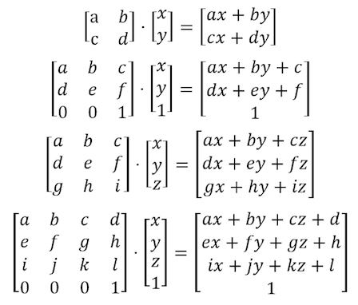

## ماتزیس های 2D

<canvas id="custom" class="canvas" data-fragment-url="matrix.frag"  width="700px" height="200px"></canvas>

### انتقال

در قسمت های قبل یاد گرفتیم چگونه اشکل مختلف بسازیم - در اصل ترفند برای حرکت دادن اشکال، حرکت دادن خود محور های مختصات است. می‌توان با اضافه کردن یک بردار به ```st``` که مقدار محل هر پیکسل را در خود نگه داشته است، این ترفند را انجام داد. با این کار تمام فضای مختصاتی حرکت می‌کند.


دیدن شکل بالا آسان تر از توضیح است، پس خودتان ببینید.:

* خط 35 را از حالت کامنت خارج کنید، تا ببینید چگونه فضا خود به خود حرکت می‌کند.

<div class="codeAndCanvas" data="cross-translate.frag"></div>

حالا تمرین زیر را انجام دهید:

* از ```u_time``` همراه با توابع شکل دهی، طوری استفاده کنید، که شکل بالا به طور جالبت تری حرکت بکند. حرکت خاصی که در نظر دارید را جستجو کنید و سعی کنید حرکت شکل بالا را مثل آن شبیه یازی کنید. ایده گرفتن از حرکات دنیای واقعی می‌تواند مفید باشد، مثلا حرکت آونگ، توپ، شتاب گرفتن ماشین یا توقف دوچرخه.

### چرخش

برای چرخاندن یک شکل، باز هم نیاز است تمام فضا را بچرخانیم. برای این کار از [matrix](http://en.wikipedia.org/wiki/Matrix_%28mathematics%29) استفاده می‌کنیم. ماتریس مجموعه ای متشکل از اعداد در سطر ها ستون هاست. بردار ها با قوانین خاصی در ماتریس ها می‌توانند ضرب شوند تا مقادیر آن بردار اصلاح و عوض شود.

[](https://en.wikipedia.org/wiki/Matrix)

در GLSL پشتیبانی از ماتریس های 2و 3 و 4 بعدی تعبیه شده است: [```mat2```](../glossary/?search=mat2) (2x2), [```mat3```](../glossary/?search=mat3) (3x3) and [```mat4```](../glossary/?search=mat4) (4x4). همچنین GLSL از ضرب ماتریس ها پشتیبانی می‌کند  (```*```) همچنین از تابع خاص ([```matrixCompMult()```](../glossary/?search=matrixCompMult)).

بر اساس رفتار ماتریس ها، می‌توانیم ماتریس هایی تولید کنیم که رفتار خاصی انجام می‌دهند، مثلا از ماتریس می‌توان برای  حرکت یک بردار استفاده کرد :


جالب تر اینکه از یک ماتریس برای چرخش سیستم مختصات می‌توانیم استفاده کنیم:


به تابعی که چرخش دو بعدی را انجام می‌دهد نگاهی بیاندازید، این تابع برای چرخش مختصات حول نقطه 0و0 از فرمول فوق پیروی می‌کند [formula](http://en.wikipedia.org/wiki/Rotation_matrix) .

```glsl
mat2 rotate2d(float _angle){
    return mat2(cos(_angle),-sin(_angle),
                sin(_angle),cos(_angle));
}
```

با توجه که روشی که در رسم اشکال داشتیم، این دقیقا آن چیزی نیست که می‌خواهیم. شکل ضربدری ما در مرکز کنوس کشیده شده است، پس قبل از چرخواندن فضا باید شکل را از مرکز به نقظه 0و0 انتقال دهیم، فضا را بچرخوانیم، سپس در نهایت شکل را به مکان اصلی آن برگردانیم.


مانند کد زیر:

<div class="codeAndCanvas" data="cross-rotate.frag"></div>

تمرین های زیر را انجام دهید:

* خط 45 را از حالت کامنت خارج کنید و ببینید چه اتفاقی در حال رخ دادن است.

* انتقال در خط های 37 و 39 را قبل و بعد از چرخش را کامنت کنید و ببینید چه اتفاقی می‌افتد.

* برای بهبود انیمیشن در در تمرین انتقال، از چرخش استفاده کنید.

### اندازه

دیدم که چگونه ماتریس ها کمک به جابه جایی و چرخش در فضا کمک می‌کنند. (یا به طور دقیق تر، انتقال سیستم مختصات برای چرخش و انتقال) اگر با نرم افزار های سه بعدی یا توابع push و pop در نزم افزار processing کار کرده باشید، می‌دانید که ماتریس ها برای تغییر اندازه اشکال هم استفاده می‌شوند.


طبق فرمول قبلی می‌توان نحوه ساخت ماتریس مقیاس دو بعدی را فهمید:

```glsl
mat2 scale(vec2 _scale){
    return mat2(_scale.x,0.0,
                0.0,_scale.y);
}
```

<div class="codeAndCanvas" data="cross-scale.frag"></div>

تمرینات زیر را انجام دهید تا عمیق تر نحوه عملکرد آن را متوجه شوید..

* خط 42 را از کامنت خارج کنید و تغییرات فضای مختصات را مشاهده کنید.

* کد های انتقال در خطوط 37 و 39 را کامنت کنید و ببینید چه اتفاقی رخ می‌دهد.

* سعی کنید ماتریس انتقال را با ماتریس اندازه(مقیاس) ترکیب کنید، توجه داشته باشید که ترتیب مهم است. ابتدا ماتریس ها را با هم ضرب کنید و سپس آنان در بردار مختصات ضرب کنید.

* حالا که نحوه کشیدن و انتقال و چرخش شکل های مختلف را می‌دانید، وقت آن است که یک شیدر ترکیبی با آن ها بسازید. یک UI مثل [fake UI or HUD (heads up display)](https://www.pinterest.com/patriciogonzv/huds/) بسازید. از این مثال داخل shader toy هم می‌توانید ایده و انگیزه بگیرید [Ndel](https://www.shadertoy.com/user/ndel).

<iframe width="800" height="450" frameborder="0" src="https://www.shadertoy.com/embed/4s2SRt?gui=true&t=10&paused=true" allowfullscreen></iframe>

### سایر کاربرد های ماتریس: YUV رنگ

[YUV](http://en.wikipedia.org/wiki/YUV) یک فضای رنگی است، که برای رمز گذاری آنالوگ عکس و فیلم است، و برای کاهش پهنای باند رنگی از دامنه درک انسان استفاده می‌کند.

کد زیر این عملیات ماتریسی را در GLSL برا تبدیل رنگ ها از حالتی به حالت دیگر نشان می‌دهد.

<div class="codeAndCanvas" data="yuv.frag"></div>

همانطور که می‌بینید با رنگ ها مانند بردار رفتار می‌کنیم و آنان را در هم ضرب می‌کنیم به این صورت ما مقادیر را به اطراف منتقل می‌کنیم.

در این قسمت یاد گرفتیم، چگونه با استفاده از ماتریس ها انتقال، تغییر مقیاس و چرخش انجام دهید. این انتقال ها برای ساخت ترکیب هایی از شکل های که قبلا آموختیم ضروری خواهند بود. در فصل بعد از آنچه تا کنون آموختیم برای ساخت پترن های رویه ای procedural patterns استفاده خواهیم کرد، و متوجه خواهید شد تکرار و تغییر کد نویسی می‌تواند یک تمرین هیجان انگیز باشد.
