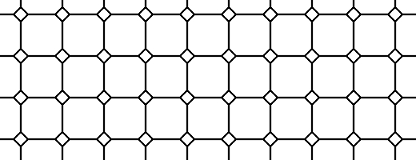
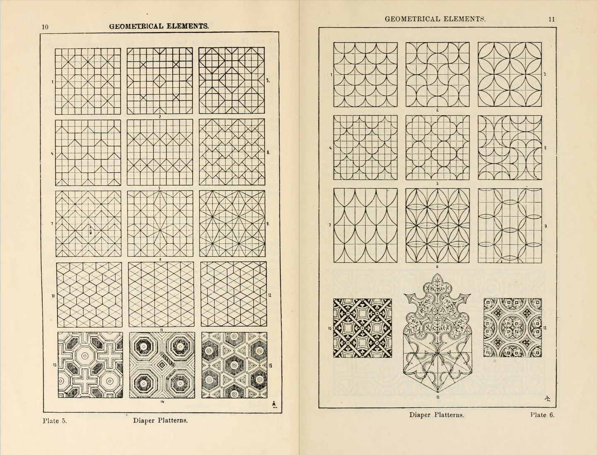

## الگو ها

از آنجا که شیدر ها پیکسل به پیکسل اجرا می‌شوند، مهم نیست که چقد یک شکل را تکرار کنید. محاسبات ثابت است. این به معنی آن است که شیدر ها برای الگو ها و پترن های تکرار شونده مناسب هستند.

[  ](../edit.php#09/dots5.frag)

در این فصل قصد داریم آنچه تا کنون آموخته ایم را بکار ببریم و در امتداد کنوس اشکال را تکرار کنیم. مانند فصل های قبلی استراتژی ما مبتی بر عملیات رو مختصات فضای بین 0.0 و 1.0 است،  به این ترتیب شکل هایی که بین 0.0 و 1.0 کشیده بودیم تکرار می‌شوند.

*"شبکه بندی چارچوبی را فراهم می‌کند که به انسان ها قدرت شهود و اختراع می‌دهد. در هرج و مرج های الگو های طبیعی هم یک انعطاف و نظم نهفته است، از الگو های اولیه روی سفال گرفته تا موزاییک های هندسی در حمام های رومی، مدت هاست مردم از شبکه ها برای بهبود و تزئیین زندگی خود استفاده می‌کنند "* [*10 PRINT*, Mit Press, (2013)](http://10print.org/)

بیایید اول تابع [```fract()```](../glossary/?search=fract) را بیاد بیاوریم. قسمت اعشاری یک عدد را بر می‌گرداند, ```fract()``` مانند ([```mod(x,1.0)```](../glossary/?search=mod)) است. به عبارت دیگر, [```fract()```](../glossary/?search=fract) عدد بعد از نقطه اعشار را بر می‌گرداند. سیستم محتصات نرمالایز شده ما (```st```) بین 0.0 و 1.0 است، پس منطقی نیست همچین کاری انجام دهم:  

```glsl
void main(){
	vec2 st = gl_FragCoord.xy/u_resolution;
	vec3 color = vec3(0.0);
    st = fract(st);
	color = vec3(st,0.0);
	gl_FragColor = vec4(color,1.0);
}
```

اما اگر سیستم مختصات را به بالا اسکیل کنیم - مثلا سه برابر - ما سه توالی درون خطی بین 0و1 داریم: اولی بین 0و1 است, بعد از آن مربوط به نقاط شناور بین 1 و 2 و همچنین بعد از آن نقاط شناور بین 2 و 3.

<div class="codeAndCanvas" data="grid-making.frag"></div>

 حال وقت آن است با برداشتن خط 27 در هر زیر فضا، شکلی ترسیم کنیم. (از آنجا که x,y ما به یک اندازه ضرب می‌شوند، نسبت ابعاد فضا تغییری نمی‌کند و اشکال مطابق انتظار تغییر می‌کنند.)

برخی از تمرینات زیر را امتحان کنید تا درک عمیق تری پیدا کنید:

* فضا را در اعداد مختلف ضرب کنید، با مقادیر اعشاری و همچنین مقادیر مختلف برای x و y.

* از عملکرد فوق، تابعی که قابل استفاده مجدد باشد بسازید.

* فضا را به سه ردیف و سه ستون تقسیم کنید، راهی پیدا کنید که بفهمید هر ترد در کدام ستون و ردیف است، از آن برای تغییر شکل و نشان دادن آن استفاده کنید. سعی کنید شکل یک بازی دوز را بسازید. 

### اعمال ماتریس داخل الگو ها

از آنجا که هر سلول نسخه کوچکتری ار سیستم مختصات نرمال شده است، می‌توان مثل قبل برای چرخش و انتقال از ماتریس ها استفاده کرد.

<div class="codeAndCanvas" data="checks.frag"></div>

* به روش های جالب تری برای متحرک سازی این الگو ها فکر کنید، رنگ و شکل و و حرکت را می‌توانید انیمیت کنید، سه انیمیشن متفاوت بسازید.

* با ترکیب اشکال مختلف الگو های پیچیده تر را از نو بسازید.


[](../edit.php#09/diamondtiles.frag)

* لایه های مختلف پترن را با هم ترکیب کنید و سعی کنید [الگوی اسکاتلندی](https://www.google.com/search?q=scottish+patterns+fabric&tbm=isch&tbo=u&source=univ&sa=X&ei=Y1aFVfmfD9P-yQTLuYCIDA&ved=0CB4QsAQ&biw=1399&bih=799#tbm=isch&q=Scottish+Tartans+Patterns) خود را بسازید.

[  ](http://graphicriver.net/item/vector-pattern-scottish-tartan/6590076)

### جابجایی الگو ها

فرض کنیم میخواهیم یک دیوار آجری بسازیم. با نگاه کردن به دیوار می‌فهمید هر ردیف، نصف اندازه آجر جابه جا شده است چگونه می‌توانیم این کار را انجام دهیم?


برای اولین قدم باید بفهمیم ردیف ترد ما یک عدد زوج است یا فرد. چون می‌توانیم با دانستن آن، مقدار x  را در آن ردیف جابجا کنیم.

____دو پاراگراف بعدی را با کمک هم باید اصلاح کنیم____

برای تعیین این که نخ ما در ردیف زوج یا فرد است از تابع باقیمانده [```mod()```](../glossary/?search=mod) بر عدد 2 استفاده میکنیم و سپس مشاهده کنیم که آیا نتیجه زیر 1.0 است یا خیر. به فرمول زیر نگاهی بیاندازید و دو خط آخر را از حالت کامنت خارج کنِد.

<div class="simpleFunction" data="y = mod(x,2.0);
// y = mod(x,2.0) < 1.0 ? 0. : 1. ;
// y = step(1.0,mod(x,2.0));"></div>

همانطور که در خط دوم مثال بالا دیدید، می‌توانیم از [اپراتور سه گانه](https://en.wikipedia.org/wiki/%3F:) استفاده کنیم و چک کنیم اگر [```mod()```](../glossary/?search=mod) بر 2 زیر 1 است یا بطور مشابه در خط سوم از تابع [```step()```](../glossary/?search=step) استفاده کنیم, روش دوم سریع تر است، اما چرا؟ می‌دانیم دانستن عملیات اجرا و بهینه سازی هر نوع کارت گرافیک دشوار است، اما توابع داخلی سریعتر اجرا می‌شوند، پس هر موقع می‌توانستید از توابع داخلی استفاده کنید، حتما بجای کد های شرطی از آنان استفاده کنید.

بنابراین اکنون که فرمول اعداد فرد خود را داریم، می‌توان برای ردیف های فرد عملیات جابه جایی را انجام دهیم، خط 14 در مثال زیر جایی است که ردیف های فرد را شناسایی می‌کنیم و آنان را نیم واحد جابجا می‌کنیم. توجه داشته باشید که برای ردیف های زوج نتیجه عملکرد ما 0.0 است و ضرب 0.0 در مقدار جابه جایی 0.5 هیچ مقداری را جابجا نمی‌کند. اما در ردیف های فرد با ضرب 1.0 در مقدار جابجایی 0.5، آن ردیف  را در محور مختصات 0.5 واحد جابجا می‌کنیم.

حال سعی کنید خط 32 را از کامنت خارج کنید، این کار نسبت ابعاد مختصات را می‌کشد تا شکل آجر مانند را تقلید کند. با خارج کردن حالت کامنت خط 40 می‌توانید ببینید چگونه سیستم مختصات به رنگ قرمز و سبز ترسیم شده است.

<div class="codeAndCanvas" data="bricks.frag"></div>

* سعی کنید جابجایی را بر حسب زمان متحرک سازی کنید.

* انیمیشن های دیگری بسازید که ردیف های زوج به سمت چپ و ردیف های فرد به سمت راست حرکت کنند.

* آیا این کار را برای ستون ها می‌توانید انجام دهید؟

* سعی کنید جابجایی در x و y را ترکیب کنید و چیزی مثل شکل زیر بسازید:

<a href="../edit.php#09/marching_dots.frag"><canvas id="custom" class="canvas" data-fragment-url="marching_dots.frag"  width="520px" height="200px"></canvas></a>

## کاشی های Truchet 

حال که می‌توانیم بفهمیم سلول هایمان در ستون ها و ردیف های زوج یا فرد هستند, پس بسته به موقعیت سلول ها می‌توان یک طراحی واحد را چندین بار استفاده کرد. الگوی [Truchet Tiles](http://en.wikipedia.org/wiki/Truchet_tiles) را در نظر بگیرید، که در آن از یک عنصر طراحی واحد می‌توان به چهار روش زیر استفاده کرد:


با تغییر الگو در میان کاشی ها، می‌توان مجموعه ای بینهایت از طرح های مختلف و پیچیده ساخت.


به تابع ```rotateTilePattern()``` خوب دقت کنید, که چگونه فضا را به چهار سلول تقسیم می‌کند و به هر کدام زاویه چرخشی اختصاص می‌دهد.

<div class="codeAndCanvas" data="truchet.frag"></div>

* خط های 69 تا 72 را از حالت کامنت خارج کنید، تا طرح های جدید را ببینید.

* الگوی مثلث سیاه و سفید را با الگویی دیگری مثل نیم دایره، مربع یا خطوط تغییر دهید.

* الگو های دیگری که عناصر آن با توجه به موقعیتشان می‌چرخند بسازید.

* الگویی بسازید که سایز خواص را با توجه به موقعیت سلول ها تغییر دهد.

* به چیز دیگری فکر کنید. چیزی که لزوما الگویی و پترنی نباشد تا بتوانید اصول این بخش را کامل یاد بگیرید چیزی مثل: (I Ching hexagrams)

<a href="../edit.php#09/iching-01.frag"><canvas id="custom" class="canvas" data-fragment-url="iching-01.frag"  width="520px" height="200px"></canvas></a>

## قوانین خودتان را بسازید

ایجاد الگو های رویه ای یک نوع تمرین ذهنی برای یافتن حداقل عناصر قابل استفاده مجدد است، این یک عمل قدیمی است;  انسان ها برای مدت طولانی است که از شبکه ها و الگو ها برای تزئین پارچه، کف زمین و اطراف اشیا استفاده می‌کنند، از الگو های داری پیچ و خم در یونان باستان، تا طراحی مشبک چینی، لذت تکرار و تغییر عناصر، چشم ما را جلب می‌کند. نگاهی به [decorative](https://archive.org/stream/traditionalmetho00chririch#page/130/mode/2up) [patterns](https://www.pinterest.com/patriciogonzv/paterns/) بیاندازید  و ببینید که چگونه هنرمندان و طراحان سابقه طولانی در پیمیاش مرز بین قابل پیش بینی بودن و تنوع و هرج و مرج دارند. از الگو های هندسی عربی گرفته تا طرح های پارچه ای و زیبای آفریقایی، الگو های زیادی برای یادگیری وجود دارد.



با اتمام این فصل درس های ما در مورد الگوریتم های شکل دهی پایان یافت، در فصل های بعد می‌ آموزیم چگونه برخی آنتروپی ها را به شیدر خورد اضافه کنیم و طرح های مولد تولید کنیم.
