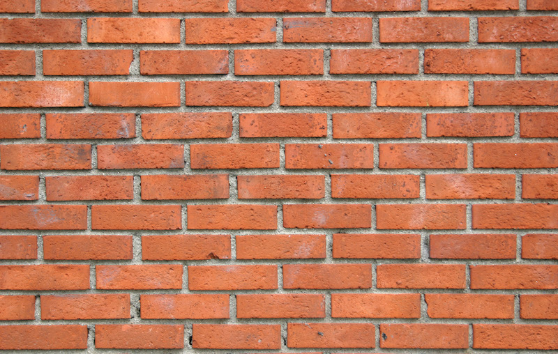

## パターン

シェーダーのプログラムはピクセルごとに並列で処理されるので、同じ形を何度も繰り返したとしても計算の回数は一定に留まります。そのためフラグメントシェーダーはタイルのような繰り返しのパターンに特に適しています。

[  ](../edit.php#09/dots5.frag)

この章ではこれまでに学んだことを応用して、描画領域のなかで繰り返しを行います。前章で行ったのと同様に、空間座標に対して掛け算を行い、0.0 から 1.0 の間に掛かれた図形がグリッド状に反復されるようにします。

*「グリッドは人間の直感と創意が働く枠組み、構築と解体のためのフレームワークを提供します。自然界のカオスの中に、規則的なパターンは対比と秩序の兆しをもたらしてくれます。
草創期の陶芸品の模様からローマ時代の浴場の幾何学的なモザイクまで、長い間人々はグリッドを用い生活を豊かに彩ってきました。」*[*10 PRINT*, Mit Press, (2013)](http://10print.org/)
（訳注：そのまま訳すのが難しい文章だったため、本人に意図を確認して言葉を補いました。）

まず [```fract()```](../glossary/?search=fract) 関数を思い出しましょう。この関数はつまるところ 1 の剰余 （[```mod(x,1.0)```](../glossary/?search=mod)）と同等です。言い換えれば [```fract()```](../glossary/?search=fract) は小数点以下の部分の数を返してくれます。正規化された座標（```st```）は既に 0.0 から 1.0 の間に収まっているので、下記のようなコードは意味を成しません。

```glsl
void main(){
	vec2 st = gl_FragCoord.xy/u_resolution;
	vec3 color = vec3(0.0);
    st = fract(st);
	color = vec3(st,0.0);
	gl_FragColor = vec4(color,1.0);
}
```

しかしここで、正規化された座標系を例えば3倍に拡大すると、0 から 1 までの滑らかに変化する値の繰り返しを3つ得ることができます。1つ目は 0 から 1 までの値、2つ目は 1 から 2 までの値の少数部分、3つ目は 2 から 3 までの値の少数部分です。

<div class="codeAndCanvas" data="grid-making.frag"></div>

さて、27行目のコメントを外して分割されたそれぞれの空間の中に何か描いてみましょう。xとyを等しく拡大しているので空間のアスペクト比は変わらず、期待した通りの形が描かれます。

下記の課題を幾つか試して理解を深めましょう。

* 空間に対して違う数をかけてみましょう。少数部分を持つ数を試したり、xとyに違う数を掛けてみましょう。

* このタイリングのテクニックを再利用可能な関数にしてみましょう。

* 空間を3行3列に分割します。スレッドがどの行と列にいるのかを知る方法を考えて、表示する図形を変えてください。Tic-tac-toe（◯×ゲーム）を描いてみましょう。

### パターンの中で行列を適用する

それぞれの分割された空間は、これまで使ってきたのと同じ正規化された座標系をただ小さくしたものになっているので、行列変換をそれぞれの空間内での平行移動や回転、拡大・縮小に使うことができます。

<div class="codeAndCanvas" data="checks.frag"></div>

* このパターンをアニメーションにする面白いアイデアを考えてください。色、形、動きの変化について考えましょう。3種類の異なるアニメーションを作成してください。

* 異なる形を組み合わせてより複雑なパターンを作ってみましょう。


<a href="../edit.php#09/diamondtiles.frag"><canvas id="custom" class="canvas" data-fragment-url="diamondtiles.frag"  width="520px" height="200px"></canvas></a>

* 異なるパターンのレイヤーを重ねてオリジナルの[タータンチェック](https://www.google.com/search?q=scottish+patterns+fabric&tbm=isch&tbo=u&source=univ&sa=X&ei=Y1aFVfmfD9P-yQTLuYCIDA&ved=0CB4QsAQ&biw=1399&bih=799#tbm=isch&q=Scottish+Tartans+Patterns)のパターンを作ってください。

[  ](http://graphicriver.net/item/vector-pattern-scottish-tartan/6590076)

### パターンをずらす

ブロックの壁を模したパターンを作りたいとします。壁を観察すると、1行おきにブロック半個分だけx座標がずれていることに気づくでしょう。



xをずらす必要があるかを決めるには、まず現在のスレッドが偶数行と奇数行のどちらに当たるのかを知る必要があります。

スレッドが偶数行か奇数行かを求めるには、2.0 の剰余（[```mod()```](../glossary/?search=mod) ）を、拡大した座標系に対して用い結果が 1.0 を下回るかどうかを見ます。下記のコードの最後の2行のコメントを外してみましょう。

<div class="simpleFunction" data="y = mod(x,2.0);
// y = mod(x,2.0) < 1.0 ? 0. : 1. ;
// y = step(1.0,mod(x,2.0));"></div>

（訳注：このサンプルではxは 0.0 から 1.0 ではなく -4 から 4 の範囲にすでに拡大されています。コメントを外すとxの整数部分が奇数になる、つまり ```mod(x, 2.0)``` が 1.0 以上になる場合にだけyが 1.0 になります。）

見てのとおり、2.0 の剰余（[```mod()```](../glossary/?search=mod)）が 1.0
を下回るかどうかの判定には、[三項演算子](https://ja.wikipedia.org/wiki/%E6%9D%A1%E4%BB%B6%E6%BC%94%E7%AE%97%E5%AD%90)（2行目）を使うか、 [```step()```](../glossary/?search=step) （3行目) を使ってより高速に処理を行うこともできます。グラフィックカードがどのように最適化されていて、どのようにコードをコンパイルするのかを知るのは難しいことですが、組み込み関数はそうでない関数に比べて高速に処理されると考えてまず問題ありません。組み込み関数が使える場合には必ず使うようにしましょう。

偶奇判定の式ができたので、これでタイルの奇数行をずらしてブロックらしく見せることができます。下記のコードの14行目の関数で、奇数行かどうかを判定して ```x``` をブロック半個分ずらしています。この行の [```step()```](../glossary/?search=step) は偶数行に対して ```0.0``` を返します。ブロック半個分の ```0.5``` をかけると結果は ```0.0```です。奇数行に対しては ```1.0``` を返すので ```0.5``` を掛けた結果、座標系をx軸方向に ```0.5``` だけ移動させることになります。

32行目のコメントを外してみましょう。こうすると座標系のアスペクト比が引き伸ばされて現代のブロックの比率になります。40行目のコメントを外すと座標系の様子が赤と緑で示されるのを見ることができます。

<div class="codeAndCanvas" data="bricks.frag"></div>

* このサンプルを、時間とともにブロックがずれていくアニメーションにしてください。

* 偶数行が左に、奇数行が右に動くアニメーションを作りましょう。

* 行方向ではなく列方向に対して同じ効果を適応することはできますか。

* ```x``` と ```y``` をずらしてこんなパターンを作ってみましょう。

<a href="../edit.php#09/marching_dots.frag"><canvas id="custom" class="canvas" data-fragment-url="marching_dots.frag"  width="520px" height="200px"></canvas></a>

## トルシェタイル

マス目が偶数行と奇数行（または列）どちらに当たるかの判定方法を学んだので、デザイン要素を場所に応じて再利用することができます。
同じデザイン要素が4種類の方法で使われる、[トルシェタイル](http://en.wikipedia.org/wiki/Truchet_tiles)を例として考えてみましょう。


タイルごとのパターンを変えることによって、複雑なデザインを無限に組み立てることができます。


```rotateTilePattern()``` に注目してください。この関数は空間を4つのマス目に分割しそれぞれに回転の角度を割り当てます。

<div class="codeAndCanvas" data="truchet.frag"></div>

* 69行目から72行目までのコメントをつけたり外したり、行をコピーしたりして新しいデザインを作りましょう。

* 黒と白の三角を他のデザイン要素、例えば半円や回転する正方形、線などに変えてみましょう。

* 要素が位置に応じて回転して配置される、新しいパターンを作成してください。

* 要素の場所によって他の属性（訳注：例えば色）を変化させるパターンを作ってください。

* 必ずしも繰り返しのパターンではないもので、この項で学んだ原則を使える例を考えてください（例：八卦の組み合わせの一覧）。

<a href="../edit.php#09/iching-01.frag"><canvas id="custom" class="canvas" data-fragment-url="iching-01.frag"  width="520px" height="200px"></canvas></a>

## 自分でルールを作る

規則によるパターン作りは、再利用可能な最小の要素を見つける頭の体操です。この行為自体は古くからあるもので、私たちの種はグリッドとパターンを織物や床をはじめ様々なものを装飾するために長い間利用してきました。曲がりくねった古代ギリシャの模様から中国の格子模様まで、反復と変化の楽しみは私たちの想像力をかきたててきました。装飾的なパターン（[例1](https://archive.org/stream/traditionalmetho00chririch#page/130/mode/2up) [例2](https://www.pinterest.com/patriciogonzv/paterns/)）をゆっくりと眺めて、予測可能な規則正しさと、驚きにあふれた変化とカオスの間の微妙な線を芸術家やデザイナー達が渡り歩いてきた様子を見てみましょう。アラブの幾何学的なパターンから、アフリカの生地のデザインまで、学ぶべき大きな世界がそこにあります。


この章で「アルゴリズムで絵を描く」のセクションは終わりです。続く章では、シェーダーに多少の無秩序さを持ち込んでデザインを生成する方法について学びます。
