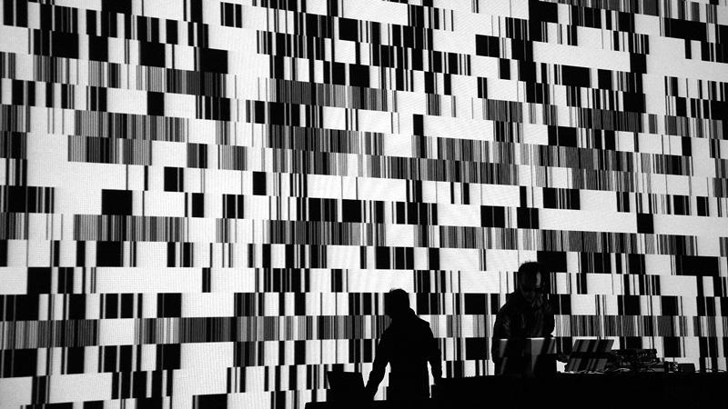

# Desain generatif

Tidaklah mengherankan bahwa setelah begitu banyak pengulangan dan keteraturan, penulis terpaksa membuat kekacauan.

## Acak

[ ](http://www.ryojiikeda.com/project/testpattern/#testpattern_live_set)

Keacakan adalah ekspresi entropi maksimal. Bagaimana kita bisa menghasilkan keacakan di dalam lingkungan kode yang tampaknya dapat diprediksi dan kaku?

Mari kita mulai dengan menganalisis fungsi berikut:

<div class="simpleFunction" data="y = fract(sin(x)*1.0);"></div>

Di atas kami mengekstraksi konten pecahan dari gelombang sinus. Nilai [```sin()```](../glossary/?search=sin) yang berfluktuasi antara ```-1.0``` dan ```1.0``` telah dipotong di belakang floating point , mengembalikan semua nilai positif antara ```0,0``` dan ```1,0```. Kita dapat menggunakan efek ini untuk mendapatkan beberapa nilai pseudo-random dengan "memecah" gelombang sinus ini menjadi potongan-potongan yang lebih kecil. Bagaimana? Dengan mengalikan resultan dari [```sin(x)```](../glossary/?search=sin) dengan angka yang lebih besar. Silakan klik fungsi di atas dan mulai tambahkan beberapa angka nol.

Pada saat Anda masuk ke ```100000.0``` (dan persamaannya terlihat seperti ini: ```y = fract(sin(x)*100000.0)```) Anda tidak dapat membedakan gelombang sinus lebih. Granularitas bagian pecahan telah merusak aliran gelombang sinus menjadi kekacauan acak semu.

## Mengontrol kekacauan

Menggunakan acak bisa jadi sulit; keduanya terlalu kacau dan terkadang tidak cukup acak. Perhatikan grafik berikut. Untuk membuatnya, kami menggunakan fungsi ```rand()``` yang diimplementasikan persis seperti yang kami jelaskan di atas.

Melihat lebih dekat, Anda dapat melihat puncak gelombang [```sin()```](../glossary/?search=sin) di ```-1.5707``` dan ```1.5707``` . Saya yakin Anda sekarang mengerti mengapa - di situlah maksimum dan minimum gelombang sinus terjadi.

Jika melihat lebih dekat pada distribusi acak, Anda akan melihat bahwa terdapat konsentrasi di sekitar tengah dibandingkan dengan tepi.

<div class="simpleFunction" data="y = rand(x);
//y = rand(x)*rand(x);
//y = sqrt(rand(x));
//y = pow(rand(x),5.);"></div>

Beberapa waktu yang lalu [Pixelero](https://pixelero.wordpress.com) menerbitkan [artikel menarik tentang distribusi acak](https://pixelero.wordpress.com/2008/04/24/various-functions-and-various-distributions-with-mathrandom/). Saya telah menambahkan beberapa fungsi yang dia gunakan pada grafik sebelumnya untuk Anda mainkan dan lihat bagaimana distribusinya dapat diubah. Hapus tanda komentar pada fungsinya dan lihat apa yang terjadi.

Jika Anda membaca [artikel Pixelero](https://pixelero.wordpress.com/2008/04/24/various-functions-and-various-distributions-with-mathrandom/), penting untuk diingat bahwa Fungsi ``` rand()``` adalah deterministik acak, juga dikenal sebagai pseudo-random. Yang artinya misalnya ```rand (1.)``` akan selalu mengembalikan nilai yang sama. [Pixelero](https://pixelero.wordpress.com/2008/04/24/various-functions-and-various-distributions-with-mathrandom/) merujuk ke fungsi ActionScript ```Math.random ()``` yang non-deterministik; setiap panggilan akan mengembalikan nilai yang berbeda.

## 2D Acak

Sekarang setelah kita memiliki pemahaman yang lebih baik tentang keacakan, saatnya untuk menerapkannya dalam dua dimensi, ke sumbu ```x``` dan ```y```. Untuk itu diperlukan suatu cara untuk mengubah vektor dua dimensi menjadi nilai floating point satu dimensi. Ada cara berbeda untuk melakukan ini, tetapi fungsi [```dot()``](../glossary/?search=dot) sangat membantu dalam kasus ini. Ini mengembalikan satu nilai float antara ```0.0``` dan ```1.0``` tergantung pada penyelarasan dua vektor.

<div class="codeAndCanvas" data="2d-random.frag"></div>

Perhatikan baris 13 sampai 15 dan perhatikan bagaimana kita membandingkan ```vec2 st``` dengan vektor dua dimensi lainnya (```vec2(12.9898,78.233)```).

* Coba ubah nilai pada baris 14 dan 15. Lihat bagaimana pola acak berubah dan pikirkan tentang apa yang bisa kita pelajari dari ini.

* Kaitkan fungsi acak ini ke interaksi mouse (```u_mouse```) dan waktu (```u_time```) untuk lebih memahami cara kerjanya.

## Menggunakan kekacauan

Acak dalam dua dimensi sangat mirip dengan noise TV, bukan? Ini adalah bahan mentah yang sulit digunakan untuk membuat gambar. Mari belajar bagaimana memanfaatkannya.

Langkah pertama kita adalah menerapkan grid padanya; menggunakan fungsi [```floor()```](../glossary/?search=floor) kita akan menghasilkan tabel integer sel. Perhatikan kode berikut, khususnya baris 22 dan 23.

<div class="codeAndCanvas" data="2d-random-mosaic.frag"></div>

Setelah menskalakan ruang sebesar 10 (pada baris 21), kami memisahkan bilangan bulat koordinat dari bagian pecahan. Kami terbiasa dengan operasi terakhir ini karena kami telah menggunakannya untuk membagi spasi menjadi sel-sel yang lebih kecil dari ```0.0``` menjadi ```1.0```. Dengan mendapatkan bilangan bulat dari koordinat kami mengisolasi nilai umum untuk wilayah piksel, yang akan terlihat seperti sel tunggal. Kemudian kita dapat menggunakan bilangan bulat umum tersebut untuk mendapatkan nilai acak untuk area tersebut. Karena fungsi acak kita bersifat deterministik, nilai acak yang dikembalikan akan konstan untuk semua piksel di sel itu.

Hapus tanda komentar pada baris 29 untuk melihat bahwa kita mempertahankan bagian mengambang dari koordinat, jadi kita masih bisa menggunakannya sebagai sistem koordinat untuk menggambar sesuatu di dalam setiap sel.

Menggabungkan dua nilai ini - bagian bilangan bulat dan bagian pecahan dari koordinat - akan memungkinkan Anda untuk mencampur variasi dan urutan.

Lihatlah port GLSL dari ```10 PRINT CHR $ (205.5 + RND (1)) yang terkenal ini; : Generator labirin GOTO 10```.

<div class="codeAndCanvas" data="2d-random-truchet.frag"></div>

Di sini saya menggunakan nilai acak sel untuk menggambar garis dalam satu arah atau yang lain menggunakan fungsi ```truchetPattern ()``` dari bab sebelumnya (baris 41 hingga 47).

Anda bisa mendapatkan pola menarik lainnya dengan menghapus tanda komentar pada blok garis antara 50 hingga 53, atau menganimasikan pola dengan menghapus komentar pada baris 35 dan 36.

## Master Acak

[Ryoji Ikeda](http://www.ryojiikeda.com/), komposer elektronik dan seniman visual Jepang, telah menguasai penggunaan random; Sulit untuk tidak tersentuh dan terpesona oleh karyanya. Penggunaannya atas keacakan dalam media audio dan visual dipalsukan sedemikian rupa sehingga bukan kekacauan yang mengganggu melainkan cerminan dari kompleksitas budaya teknologi kita.

<iframe src="https://player.vimeo.com/video/76813693?title=0&byline=0&portrait=0" width="800" height="450" frameborder="0" webkitallowfullscreen mozallowfullscreen allowfullscreen></iframe>

Lihatlah karya [Ikeda](http://www.ryojiikeda.com/) dan coba latihan berikut:

* Buat baris sel yang bergerak (dalam arah berlawanan) dengan nilai acak. Hanya tampilkan sel dengan nilai yang lebih cerah. Buat kecepatan baris berfluktuasi seiring waktu.

<a href="../edit.php#10/ikeda-00.frag"><canvas id="custom" class="canvas" data-fragment-url="ikeda-00.frag"  width="520px" height="200px"></canvas></a>

* Demikian pula buat beberapa baris tetapi masing-masing dengan kecepatan dan arah yang berbeda. Kaitkan posisi mouse ke ambang batas sel yang akan ditampilkan.

<a href="../edit.php#10/ikeda-03.frag"><canvas id="custom" class="canvas" data-fragment-url="ikeda-03.frag"  width="520px" height="200px"></canvas></a>

* Buat efek menarik lainnya.

<a href="../edit.php#10/ikeda-04.frag"><canvas id="custom" class="canvas" data-fragment-url="ikeda-04.frag"  width="520px" height="200px"></canvas></a>

Menggunakan acak secara estetika bisa menjadi masalah, terutama jika Anda ingin membuat simulasi yang terlihat natural. Acak terlalu kacau dan sangat sedikit hal yang terlihat ```acak()``` dalam kehidupan nyata. Jika Anda melihat pada pola hujan atau grafik saham, yang keduanya cukup acak, keduanya tidak seperti pola acak yang kita buat di awal bab ini. Alasannya? Nah, nilai acak tidak memiliki korelasi di antara mereka apa pun, tetapi sebagian besar pola alami memiliki ingatan tentang keadaan sebelumnya.

Di bab berikutnya, kita akan belajar tentang noise, cara yang halus dan *terlihat alami* untuk menciptakan kekacauan komputasi.