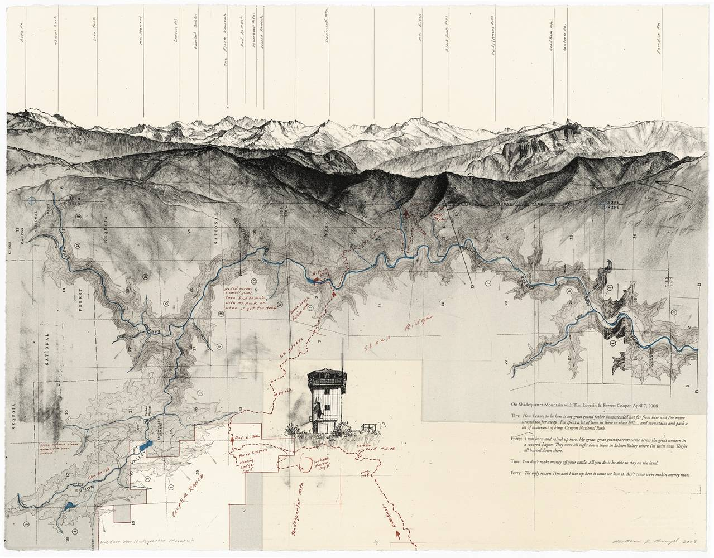
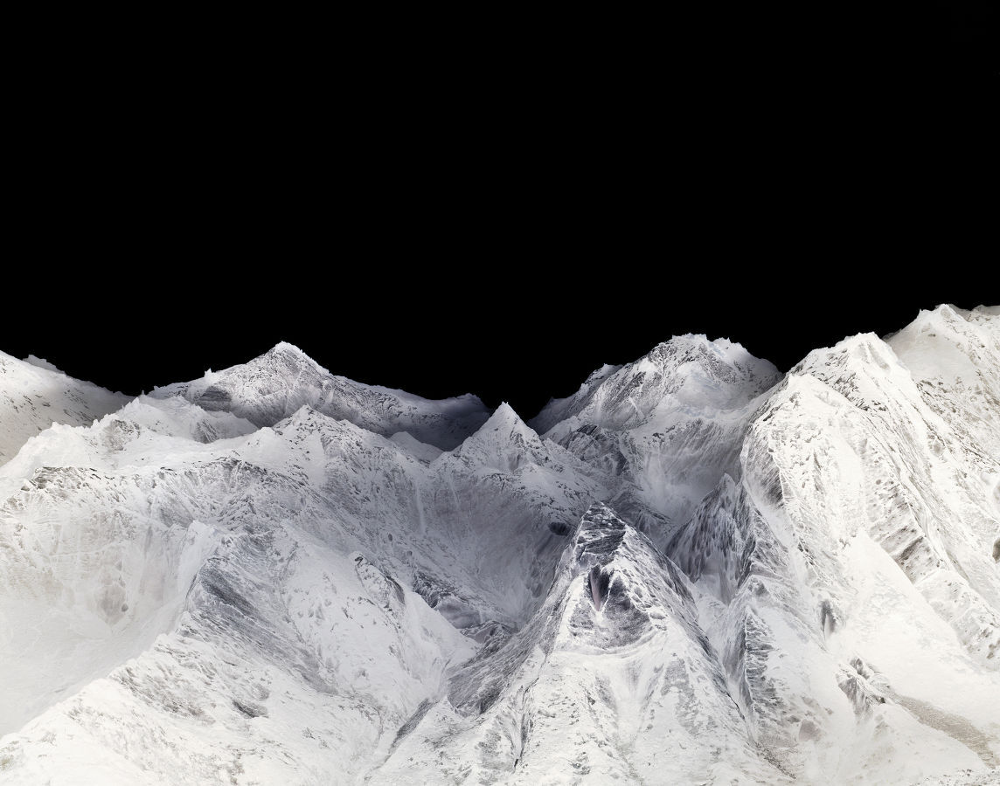

## Chuyển động Brown (Fractal Brownian motion)

Nói về nhiễu, mỗi người sẽ có một suy nghĩ khác nhau. Các nhạc công sẽ nghĩ về những tiếng ồn khó chịu, các nhà vật lý thiên văn học thì nghĩ tới bức xạ nền vi sóng vũ trụ, còn trong giao tiếp thì nhiễu dùng để chỉ các yếu tố gây mất tập trung. Các khái niệm này đưa chúng ta trở lại với môn Vật lý phổ thông để giải thích những tính chất đằng sau sự ngẫu nhiên. Tuy nhiên, hãy bắt đầu với thứ gì đó cơ bản hơn: Sóng và các tính chất của nó. Một sóng sự dao động của một vài thuộc tính vật lý theo thời gian. Sóng âm là sự dao động của áp suất không khí, sóng điện từ là dao động trong điện trường và từ trường. Hai tính chất quan trọng của sóng là biên độ và tần số. Phương trình sóng tuyến tính (một chiều) nhìn như sau:

<div class="simpleFunction" data="
float amplitude = 1.;
float frequency = 1.;
y = amplitude * sin(x * frequency);
"></div>

* Hãy thử thay đổi giá trị của biên độ và tần số để xem đồ thị thay đổi tương ứng như thế nào.
* Thay đổi biên độ theo thời gian bằng các hàm hình dạng
* Thay đổi tần số theo thời gian bằng các hàm hình dạng

Người dịch: Nếu mỗi khi tăng tần số bạn lại giảm biên độ một đại lượng tương ứng, bạn sẽ thấy "một phiên bản thu nhỏ" của sóng ban đầu, như đoạn code dưới đây. Bạn có thể dùng [GraphToy](http://www.iquilezles.org/apps/graphtoy/) để vẽ từng sóng này rời nhau, bạn sẽ thấy rõ hơn. Các họa tiết nhìn giống nhau chỉ khác về kích thước như vậy được gọi là Fractal.

<div class="simpleFunction" data="
float amplitude = 1.;
float frequency = 1.;
float scale = 8.; // sửa dòng này để thấy từng cấp của pattern Fractal
y = amplitude * 1. / scale * sin(x * frequency * scale);
"></div>

Hai yêu cầu cuối sẽ giúp bạn thuần thục hơn trong kỹ năng kiểm soát (modulate) sóng sin, và hai sóng mà bạn vừa tạo ra có tên gọi riêng, đó là AM (Amplitude Modulated) và FM (Frequency Modulated). Chúc mừng nhé !

Một đặc điểm khác cũng thú vị không kém của các sóng là chúng có thể cộng dồn và chồng chất lên nhau. Hãy comment/Uncomment và sửa các dòng code sau và chú ý vào sự thay đổi của đồ thị khi ta chồng các sóng có biên độ và tần số khác nhau.

<div class="simpleFunction" data="
float amplitude = 1.;
float frequency = 1.;
y = sin(x * frequency);
float t = 0.01*(-u_time*130.0);
y += sin(x*frequency*2.1 + t)*4.5;
y += sin(x*frequency*1.72 + t*1.121)*4.0;
y += sin(x*frequency*2.221 + t*0.437)*5.0;
y += sin(x*frequency*3.1122+ t*4.269)*2.5;
y *= amplitude*0.06;
"></div>

* Hãy thử thêm bớt từng sóng.
* Có thể tạo hai sóng triệt tiêu lẫn nhau không ? Nếu có thì trông chúng như thế nào ?
* Có thể tạo hai sóng hoàn toàn khuếch đại lẫn nhau không ? Nếu có thì trông chúng như thế nào ?

Trong âm nhạc, mỗi nốt nhạc tương ứng với một tần số. Những tần số này tuân theo một pattern mà ta gọi là gam / âm giai, khi tăng gấp đôi hoặc giảm một nửa tần số ta được các nốt nhạc ở một quãng tám ngay trên và dưới các nốt ban đầu. 

Giờ hãy dùng Perlin noise thay vì sóng sin. Perlin noise ở dạng cơ bản nhất nhìn cũng na ná sóng sin. Dù cho biên độ và tần số của nó có sai số đi nữa, biên độ vẫn có mức ổn định chấp nhận được còn tần số thì bị giới hạn để chỉ dao động quanh mốc tần số trung tâm. Tuy không phổ biến như sóng sin, nhưng, nếu chồng nhiều sóng nhiễu lên ta có thể tạo nên sự ngẫu nhiên mong muốn. Còn nếu chồng các sóng sin lên nhau mà vẫn muốn tạo ra sự ngẫu nhiên thì sẽ tốn khá nhiều công để che giấu tần số.

Thay vì dùng các sóng nhiễu giống hệt nhau, ta sẽ dùng các cấp fractal của sóng. Cứ mỗi lần chồng thêm một sóng nhiễu (tức thêm một *quãng tám - octaves*), ta sẽ tăng tần số bằng cách nhân với một đại lượng cố định (*lacunarity*) và giảm biên độ cũng bằng cách nhân với một đại lượng cố định (*gain*), kết quả thu được là sóng nhiễu ngày càng chi tiết hơn. Kỹ thuật này gọi là chuyển động Brown - "fractal Brownian Motion" (*fBm*), hoặc đơn giản là nhiễu phân dạng - "fractal noise", có thể sinh bởi đoạn code sau:

<div class="simpleFunction" data="// Các thuộc tính
const int octaves = 1;
float lacunarity = 2.0;
float gain = 0.5;
//
// Giá trị ban đầu
float amplitude = 0.5;
float frequency = 1.;
//
// Vòng lặp các quãng tám
for (int i = 0; i < octaves; i++) {
&#9;y += amplitude * noise(frequency*x);
&#9;frequency *= lacunarity;
&#9;amplitude *= gain;
}"></div>

* Hãy thử thay đổi giá trị của quãng tám từ 1 lên 2, 4, 8, 10 và xem đồ thị thay đổi ra sao.
* Với số quãng tám lớn hơn 4, hãy thử thay đổi giá trị lacunarity.
* Cũng với số quãng tám lớn hơn 4, hãy thử thay đổi giá trị gain.

Bạn sẽ dễ dàng nhận ra cứ chồng thêm một quãng tám, đồ thị lại càng chi tiết hơn. Mỗi cấp sóng nhiễu được thêm vào lại giống như một phiên bản tí hon của cấp trước đó. Đó là một tính chất quan trọng của phân dạng (fractal) trong Toán học. Thực ra thì ta không tạo ra một phân dạng *thực thụ*, vì số vòng lặp giới hạn, nhưng về lý thuyết thì điều đó có thể với một vòng lặp vô hạn. Trong lĩnh vực đồ họa máy tính thì ta luôn phải đánh đổi sự chi tiết với số lượng phép tính cần thực hiện. Trong trường hợp này, nếu sự thay đổi của đồ thị nhỏ hơn kích thước của một điểm ảnh thì việc tiếp tục chồng thêm quãng tám là không cần thiết nữa. 

Dưới đây là ví dụ tôi dùng fBm trong không gian 2 chiều để tạo nên họa tiết phân dạng:

<div class='codeAndCanvas' data='2d-fbm.frag'></div>

* Hãy thử giảm số quãng tám ở dòng 37
* Hãy thử sửa tham số lacunarity ở dòng 47
* Hãy thử sửa tham số gain ở dòng 48

Kỹ thuật này rất hay được sử dụng để tạo nên các địa hình ngẫu nhiên. Tính chất tương tự của các cấp fractal trong fBm vô cùng thích hợp để mô tả các ngọn núi, vì quá trình ăn mòn để tạo nên các ngọn núi cũng được mô phỏng bằng chính đặc tính này. Nếu bạn thích chủ đề này, tôi đặc biệt giới thiệu [nghiên cứu tuyệt vời này của Inigo Quiles về nhiễu cao cấp](http://www.iquilezles.org/www/articles/morenoise/morenoise.htm).



Sử dụng các kỹ thuật tương tự, ta có thể tạo nên hiệu ứng **nhiễu loạn - turbulence**. Thực ra nó chính là fBm nhưng sử dụng các giá trị tuyệt đối của nhiễu để tạo nên các hố sâu, gọi là thung lũng.

```glsl
for (int i = 0; i < OCTAVES; i++) {
    value += amplitude * abs(snoise(st));
    st *= 2.;
    amplitude *= .5;
}
```

<a href="../edit.php#13/turbulence.frag"></img></a>

Một thành viên khác trong họ thuật toán này là **dãy núi - ridge**, chỉ khác là thay vì có các thung lũng sâu, ta có các dãy núi dựng đứng:

```glsl
    n = abs(n);     // tạo các rãnh thung lũng
    n = offset - n; // đảo ngược thung lũng thành đỉnh núi
    n = n * n;      // tăng góc nghiêng của các đỉnh núi
```

<a href="../edit.php#13/ridge.frag"></img></a>

Một biến thể khác để tạo ra các sóng nhiễu đa dạng hơn, đó là nhân giá trị của các vị trí tương ứng trên các sóng nhiễu lại với nhau, thay vì cộng dồn. Và các cấp sóng fractal có thể được scale dựa vào cấp trước đó, những sóng kết quả sẽ được gọi là "multifractal". Tuy các sóng "multifractal" không chặt chẽ về mặt Toán học lắm, nhưng điều đó không làm giảm tính hữu dụng của chúng trong đồ họa máy tính. Thực tế thì chúng rất hay được sử dụng ở các phần mềm thương mại giúp sinh ra các loại địa hình khác nhau. Để tìm hiểu thêm, bạn có thể đọc chương 16 của quyển "Texturing and Modeling: a Procedural Approach" (lần xuất bản thứ 3), được viết bởi Kenton Musgrave. Rất tiếc là bản in của quyển sách này đã hết sạch từ vài năm trước rồi, nhưng bạn vẫn có thể tìm mượn ở thư viện hoặc mua lại sách cũ. (Tuy rằng có phiên bản PDF được rao bán trên mạng nhưng bạn đừng phí tiền mua nó, bởi đó là phiên bản cũ từ năm 1994, không hề đề cập tới việc sinh địa hình tự động mà tôi nhắc tới ở đây).

### Bẻ cong không gian

[Inigo Quiles có đăng một nghiên cứu thú vị](http://www.iquilezles.org/www/articles/warp/warp.htm) về cách dùng fBm để bẻ cong không gian (tức hệ tọa độ) của một fBm khác. Xoắn não thật sự luôn. Chẳng khác gì những giấc mơ lồng nhau trong bộ phim Inception cả.


Một ví dụ dễ thở hơn của kỹ thuật này được thực hiện bởi đoạn code dưới đây, để sinh ra các họa tiết mô phỏng những đám mây. Nếu để ý bạn sẽ đặc tính tương tự nhiều cấp (self-similarity) vẫn có trong họa tiết sau cùng.

<div class='codeAndCanvas' data='clouds.frag'></div>

Việc bẻ công hệ tọa độ của texture bằng nhiễu rất có ích lại còn hay ho nữa, nhưng rất khó để sử dụng thành thạo nếu không kiên trì tập luyện. 

Một kỹ thuật khác cũng hay được dùng là dùng nhiễu để can thiệp vào dải gradient khi blend giữa các đỉnh (xét về mặt Toán học, đó chính là đạo hàm của phương trình sóng). Đây là [một bài nghiên cứu của Ken Perlin và Fabrice Neyret về "flow noise"](http://evasion.imag.fr/Publications/2001/PN01/) dựa trên ý tưởng này. Một vài phiên bản code hiện tại của Perlin noise đã tính cả sóng nhiễu và tích phân của dải màu gradient luôn. Nếu thông tin về dải màu "chi tiết" không được cung cấp thì bạn hoàn toàn có thể dùng phương pháp sai phân hữu hạn để tính xấp xỉ, dù cho kết quả sẽ không được chính xác tuyệt đối và cũng hơi mất công nữa.
