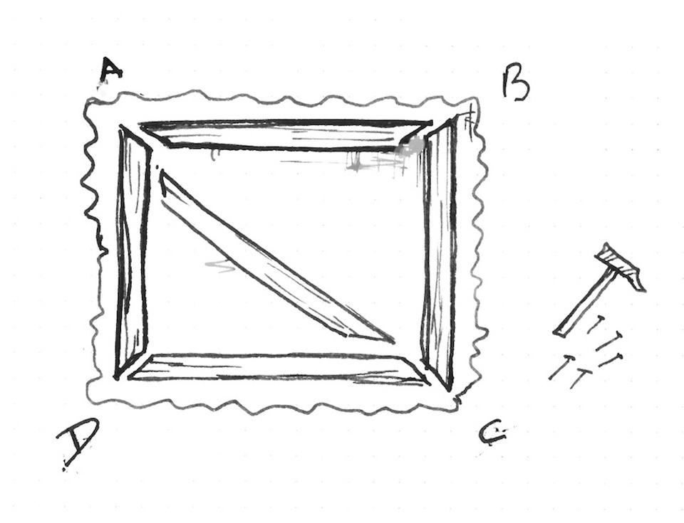

# Processamento de imagens

## Texturas


Placas gráficas (GPUs) têm tipos especiais de memórias para imagens. Geralmente, nas CPUs as imagens são armazenadas como arrays de bytes, mas as GPUs armazenam as imagens como ```sampler2D```, o que é mais como uma tabela (ou matriz) de vetores de ponto flutuante. Mais interessante ainda, os valores dessa  *tabela* de vetores são contínuos. Isso quer dizer que os valores entre os pixels são interpolados em baixo nível.

Para usar essa característica, primeiro precisamos fazer um *upload* da imagem da CPU para a GPU, para então passar o```id``` da textura para o [```uniform```](../05) correto. Tudo isso acontece fora do shader.

Uma vez que a textura esteja carregada e linkada a um ```uniform sampler2D``` válido, você pode solicitar valores específicos de cores em coordenadas específicas (formatadas em uma variiável [```vec2```](index.html#vec2.md)) usanto a função [```texture2D()```](index.html#texture2D.md) que vai retornar uma cor formatada em uma variável [```vec4```](index.html#vec4.md).

```glsl
vec4 texture2D(sampler2D texture, vec2 coordinates)  
```

Verifique o seguinte código onde carregamos a Onda de Hokusai (1830) como um ```uniform sampler2D u_tex0``` e chamamos cada pixel dela dentro da tela:

<div class="codeAndCanvas" data="texture.frag" data-textures="hokusai.jpg"></div>

Se você prestar atenção, vai notar que as coordenadas da textura estão normalizadas! Que surpresa, certo? As coordenadas das texturas são consistentes com o resto das coisas que já vimos e suas coordenadas estão entre 0.0 e 1.0, o que combina perfeitamente com o espaço normalizado de coordenadas que temos usado. 

Agora que você já viu como carregamos uma textura de forma correta, é hora de fazer experiências, para descobrir o que podemos fazer com isso, tentando:

* Escalar a textura anterior, pela metade.
* Rotacionar a textura anterior em 90 graus.
* Ligar a posição do mouse às coordenadas, e movê-la.

Por que você deveria estar anomado com as texturas? Bem, antes de tudo, esqueça os 255 valores tristes para o canal, uma vez que sua imagem esteja transformada em um ```uniform sampler2D``` você terá todos os valores entre 0.0 e 1.0 (dependendo do que você setar na ```precision```). É  por isso que as os shaders podem fazer efeitos realmente lindos pós-processament.

Em segundo lugar, o [```vec2()```](index.html#vec2.md) significa que você pode pegar os valores entre os pixels. Como dizemos antes, as texturas são um continuum. Isso quer dizer que se você configurar sua textura corretamente, você pode pedir valores em torno de toda a superfície de sua imagem, e os valores vão variar suavemente de pixel a pixel, sem pulos!

Por fim, você pode setar sua imagem para repetir nas bordas, então você pode dar valores além ou menores que os normalizados 0.0 e 1.0, os valores vão dar a volta e recomeçar.

Todas essas características fazem suas imagens mais como uma fábrica infinita. Você pode esticar e encolher sua textura sem notar a grade de bytes de que elas são compostas originalmente, ou o fim dela. Para experimentar isso, dê uma olhada no seguinte código, onde nós distorcemos uma textura usando a [função de ruído que já fizemos](../11/).

<div class="codeAndCanvas" data="texture-noise.frag" data-textures="hokusai.jpg"></div>

## Resolução de Texturas

Os exemplos acima rodam bem com imagens quadradas, onde os dois lados são iguais e combinam uma tela quadrada. Mas para imagens não-quadradas, as coisas podem ser um pouco mais complicadas, e infelizmente, séculos de art de imagens e fotos descobriram ser mais agradáveis aos olhos as proporções não-quadradas.


Como podemos resolver este problema? Bem, precisamos saber as proporções originais da imagem para saber como esticar a textura corretamente, de forma a ter o [*aspect ratio*](http://en.wikipedia.org/wiki/Aspect_ratio) (proporção da tela) original. Para isso, a largura e altura da textura são passados para o shader como um ```uniform``` que, no nosso framework de exemplo são passados como um ```uniform vec2``` com o mesmo nome da textura seguida da proposição ```Resolution```. Uma vez que temos essa informação no shader, podemos pegar o aspect ratio dividindo-se o ```width``` (largura) pelo ```height``` (altura) da resolução da textura. Finalmente, multiplicando-se essa taxa com as coordenadas em ```y``` vamos encolher esse eixo para combinar com as proporções originais.

Descomente a linha 21 do código a seguir para ver isso em ação.

<div class="codeAndCanvas" data="texture-resolution.frag" data-textures="nicephore.jpg"></div>

* O que precisamos fazer para centralizar essa imagem?

## Estofamento digital 



Você deve estar pensando que isso é algo desnecessariamente complicado... e provavelmente está certo. Também, esse modo de trabalhar com imagens deixa espaço suficiente para hacks diferentes e truques criativos. Tente imaginar que você é um estofador e, ao esticar e dobrar um tecido sobre uma estrutura, pode criar padrões e técnicas novas e melhores. 


Esse nível de artesanato faz referência a alguns dos primeiros experimentos óticos já feitos. Por exemplo, em *animações de sprites* de jogos, são bem comuns, e é inevitável ver nele uma reminiscência ao fenacistoscópio, ao zootropo e ao praxinoscópio.

Isso poderia parecer simples, mas as possibilidades de modificar coordenadas de texturas são enormes. Por exemplo:

<div class="codeAndCanvas" data="texture-sprite.frag" data-textures="muybridge.jpg"></div>

Agora é sua vez:

* Você consegue fazer um caleidoscópio usando o que aprendemos?

* Muito antes do Oculus ou do cardboard do google, a fotografoa estereoscópica era uma coisa incrível. Você poderia programar um shader simples para reutilizar essas lindas imagens?

<a href=“../edit.php#10/ikeda-03.frag”><canvas id=“custom” class=“canvas” data-fragment-url=“ikeda-03.frag”  width=“520px” height=“200px”></canvas></a>


* Que outros brinquedos óticos você pode recriar usando texturas?

Nos próximos capítulos, você vai aprender como fazer algum processamento em imagens, com os shaders. Vai notar que, finalmente, a complexidade do shaders faz sentido, porque ele foi, de certa forma, projetada para fazer esse tipo de processo. Vamos começar a fazer alguma operação com imagens!
